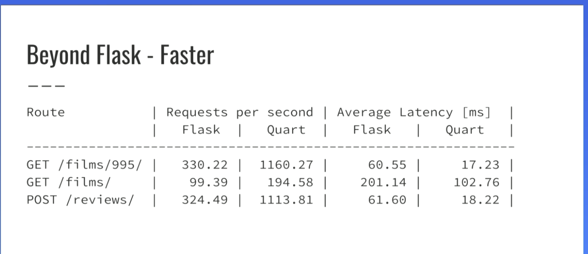

# Resources
- [Pycon 2017 Async Intro](https://www.youtube.com/watch?v=iG6fr81xHKA) by Miguel Greenberg
- [A Really Gentle Introduction to Asyncio](https://www.youtube.com/watch?v=3mb9jFAHRfw)
- [A history of Asyncio](https://www.youtube.com/watch?v=ReXxO_azV-w) by Yury Selanov, a Python Core dev
- [A good overview](https://docs.python.org/3/library/asyncio-task.html) of the whole thing from the Python Docs
- `ensure_future` vs `create_task` [stack overflow discussion](https://stackoverflow.com/questions/36342899/asyncio-ensure-future-vs-baseeventloop-create-task-vs-simple-coroutine)
	- “If you know that you have a coroutine and you want it to be scheduled, the correct API to use is create\_task(). The only time when you should be calling ensure\_future() is when you are providing an API (like most of asyncio's own APIs) that accepts either a coroutine or a Future and you need to do something to it that requires you to have a Future”
- [3x faster Flask apps](https://hackernoon.com/3x-faster-than-flask-8e89bfbe8e4f)
	- 
- [Quart: An ASGI alternative to Flask](https://www.youtube.com/watch?v=t8-Y7Kivuu0)

# Udemy Landing Page

## Title: From Flask to Quart: Async Python Web Development
## Sub-title: Learn how to build professional Python asynchronous applications using the Quart framework

## Course summary:
### What is the course about?
“From Flask to Quart” will introduce you to a new dimension in the world of Python Web Development: Asynchronous Python application development.

Introduced with Python version 3.7, the Asynchronous I/O library, also called “asyncio”, allows developers to write code that runs concurrently as opposed to sequentially, which translates into a higher throughput of your application in situations where response time and speed are really important.

Programming with asyncio does require a different way of thinking on how you develop your code and we will go over those idiosyncrasies as we develop, step by step and from simple to complex, different asynchronous applications that will introduce you to these new concepts.

The star of this course is the Quart web framework. Built on top of the Flask micro framework, Quart shares a lot of the common functionality you’re already used to working with in Flask, but under the hood, has converted the low-level API functions to work in asynchronous fashion, bringing the best of two worlds together.

We will also have a chance to work with asynchronous database libraries, like aiomysql and motor, which allows your async applications to talk to both MySql and MongoDB databases.

We will also explore some of the frontend communication channels that leverage your async applications on the javascript side, which will produce hyper-responsive web applications for your users.

So come on in and begin our journey to the new world of async Python web development.

### Why take this course?
If you are interested in learning how to code from zero and without prior knowledge, but do it using best industry practices towards becoming a professional backend web developer, this is the course for you.

### How is the course structured?
The course is divided in 7 sections:
- Introduction
- Your Development Environment
- Say Hello World
- Setting up our Database
- A Visitor Counter
- Flogger: A Personal Blog Application
- Final Project

### What type of material is included?
The course has more than 4 hours of video tutorials as well as the source code of all the lessons, so that you can see exactly what the whole project looks like in each stage.

### How long does it take to complete the course?
The course can take anywhere from 7 days to a month to complete based on how much material the student completes daily.

Additionally we’re constantly updating the course, adding contents thanks to the feedback of our students.

So stop looking around and start the right path to becoming a professional Python backend web developer with this course!

## Goals and objectives:
- You will be learn the basics of the Python Web programming
- You will learn what databases are and how to use them effectively
- You will learn how to interact with the database using the MySQL CLI
- You will learn how to effectively develop a Flask application
- You will learn how to use WTForms library for effective form management
- You will learn how to upload images to a web application
 
Audience:
Programmers, Software Developers, Project Managers, Computer students, Entrepreneurs, Software development aficionados

Requirements:
- A computer with internet access and administrative access to install packages
- A basic understanding of the Python language
- A basic understanding of how to use the internet and text editors
