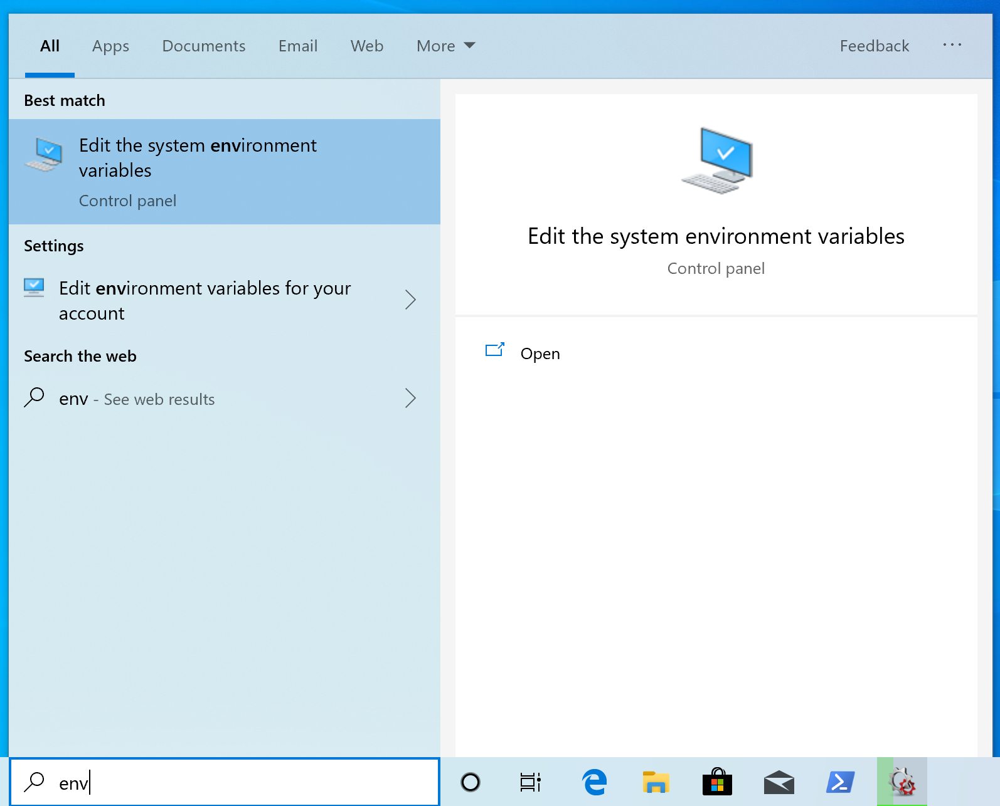
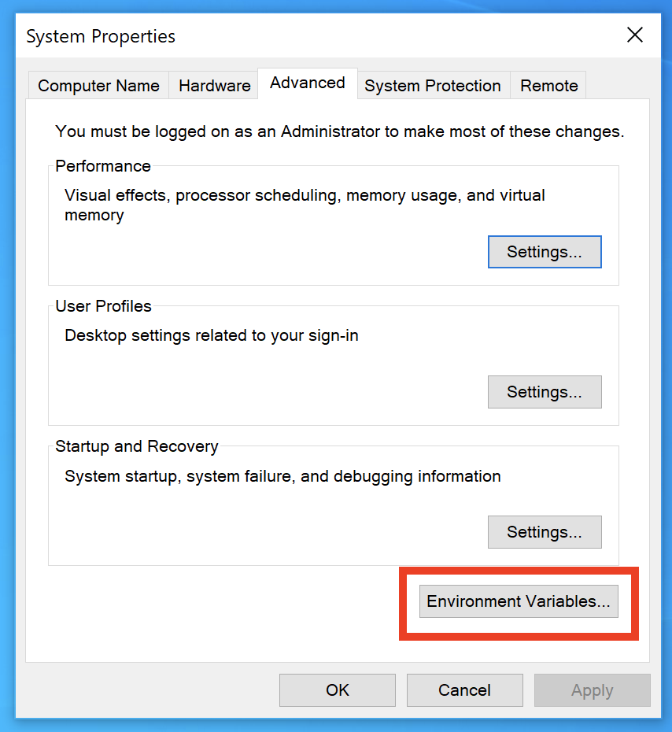
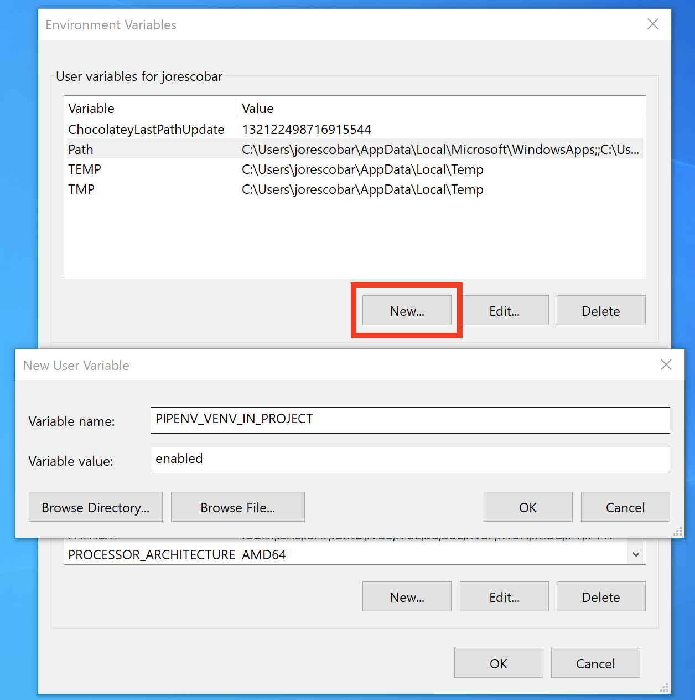

# A Quart Database Counter

As you have seen in my other courses, I like to make real database driven applications using either MySQL or MongoDB.

In the next few lessons, we’ll build a counter app that will be a good boilerplate application for your Mysql-based Quart projects. I will take the concepts from my [Flask MySQL Boilerplate app](https://github.com/fromzeroedu/flask-mysql-boilerplate) but make it asynchronous and of course, use Quart.

But before we start writing the application, we need to understand one of the many quirks we’ll see when working with asynchronous applications, and this one is related to database ORMs. 

## ORMs and Async
For our original Flask MySQL boilerplate application, we used SQLAlchemy, the Python Database ORM or Object Relational Mapper.  However, for async projects we can’t use the same library without some form of penalization.

Flask-SQLAlchemy does work with Quart using the `flask_patch` function we discussed earlier, but it doesn't yield to the event loop when it does I/O. This will mean it cannot handle much concurrent load — [only a couple of concurrent requests](https://gitter.im/python-quart/lobby?at=5cd1da132e2caa1aa625ef83).

There’s also some issues that I won’t go into in too much detail, having to do with the overhead of how Python handles MySQL connections and the type of locking your transactions can do. I suggest you read [this blog post](http://techspot.zzzeek.org/2015/02/15/asynchronous-python-and-databases/) from Mike Bayer, the author of SQLAlchemy if you want to learn more about the subject. 

However, we don’t need to go back to using raw SQL queries in our codebase. It just happens that we can use the SQLAlchemy Core package from SQLAlchemy, which allows us to express queries in a nice way without the ORM overhead.

We’ll also be using the `aiomyql` package to connect to MySQL asynchronously.

So let’s go ahead and start coding our Quart MySQL boilerplate.

## Initial Setup
So let’s go ahead and start setting up our Quart MySQL boilerplate application. Like I’ve done in other courses, we’re going to build a counter application that stores a counter in MySQL and increases it by one every time you reload the page. This will allow us to see how a typical Quart MySQL application is laid out.

One new thing we’ll use here is Alembic for database migrations. Alembic is what powers Flask-Migrations under the hood, but Flask-Migrations won’t work with Quart since it uses the ORM component. Even though it’s a bit more complicated to set it up the first time, we will be using this boilerplate when we create other MySQL Quart applications down the road, so we won’t have to repeat the setup from scratch again.

So let’s begin by creating the Quart environment variables that will be loaded to our environment by `python-dotenv`. 

Make sure to create the project’s folder. I’ll call mine `quart-mysql-boilerplate`. Once that’s done, change the directory inside that folder.

So create the `.quartenv` file and type the following code:

{lang=bash,line-numbers=off}
```
QUART_APP='manage.py'
QUART_ENV=development
SECRET_KEY='my_secret_key'
DB_USERNAME=counter_user
DB_PASSWORD=counter_password
DB_HOST=localhost
DATABASE_NAME=counter
MYSQL_ROOT_PASSWORD=rootpass
```

First, the `QUART_APP` will be small kickstarter `manage.py` file that creates an instance of our application using the Factory pattern, just like I’ve done previously on my Flask course. 

Next  the `QUART_ENV` environment we’ll define as `development` so that we have meaningful error pages. We’ll also add a `SECRET_KEY`; even though it’s not essentially needed, it’s a good practice to have it.

The next five variables, `DB_USERNAME`, `DB_PASSWORD`, `DB_HOST`, and `DATABASE_NAME` will allow us to connect to the database. The `MYSQL_ROOT_PASSWORD` is needed so that our test utility can create the test database and destroy it on demand.

Save the file[^1].

We’ll now need to create a `settings.py` file, so we’ll use very similar variables from the `.quartenv` with the following format:

{lang=python,line-numbers=on}
```
import os

SECRET_KEY = os.environ["SECRET_KEY"]
DB_USERNAME = os.environ["DB_USERNAME"]
DB_PASSWORD = os.environ["DB_PASSWORD"]
DB_HOST = os.environ["DB_HOST"]
DATABASE_NAME = os.environ["DATABASE_NAME"]
MYSQL_ROOT_PASSWORD = os.environ["MYSQL_ROOT_PASSWORD"]
```

As we saw earlier, `python-dotenv` will load the variables In `.quartenv` and load it as environment variables in our computer, so then `settings.py` can access them using `os.environ`. We do this so that we can then deploy to a production environment easily with the proper environment variables set in the production hosts. Save the file[^2].

We’ll now initialize our `pipenv` environment using the `python 3.7` initialization to guarantee we have the right Python version in the `Pipfile`.

{lang=bash,line-numbers=on}
```
$ pipenv install --python 3.7
Creating a virtualenv for this project…
Pipfile: /opt/quart-mysql-boilerplate/Pipfile
Using /usr/local/bin/python3 (3.7.3) to create virtualenv…
⠼ Creating virtual environment...Using base prefix '/usr/local/Cellar/python/3.7.3/Frameworks/Python.framework/Versions/3.7'
New python executable in /opt/quart-mysql-boilerplate/.venv/bin/python3.7
Also creating executable in /opt/quart-mysql-boilerplate/.venv/bin/python
Installing setuptools, pip, wheel...
done.
Running virtualenv with interpreter /usr/local/bin/python3

Successfully created virtual environment!
Virtualenv location: /opt/quart-mysql-boilerplate/.venv
Creating a Pipfile for this project…
Pipfile.lock not found, creating…
Locking [dev-packages] dependencies…
Locking [packages] dependencies…
Updated Pipfile.lock (a65489)!
Installing dependencies from Pipfile.lock (a65489)…
0/0 — 00:00:00
To activate this project's virtualenv, run pipenv shell.
Alternatively, run a command inside the virtualenv with pipenv run.
```

You might notice that the virtual environment that `Pipenv` created was located inside my working directory. This is not the default behavior, but I like to have the `venv` directory alongside my code, without committing it. To make that your default behavior, you need to set an environment variable in your host with the name `PIPENV_VENV_IN_PROJECT` set to `enabled`. On Mac you can add it to your `bash_profile` like this:

{lang=python,line-numbers=off}
```
export PIPENV_VENV_IN_PROJECT="enabled"
```

 In Windows 10, just edit your System Environment variables and set it. You can find them by typing `env` on your Windows search and click on the “Edit the System Environment Variables”.



Then click on the “Environment Variables” button on the lower right.



Click the “New” button, add the `PIPENV_VENV_IN_PROJECT` variable and set the value to “enabled”.



Now let’s go ahead and install Quart and `python-dotenv`.

{lang=bash,line-numbers=off}
```
$ pipenv install quart python-dotenv 
```

We’re now ready to start setting up MySQL and Alembic migrations.


[^1]:	https://github.com/fromzeroedu/quart-mysql-boilerplate/blob/step-1/.quartenv

[^2]:	https://github.com/fromzeroedu/quart-mysql-boilerplate/blob/step-1/settings.py

## Setting up MySQL

Let’s now start to setup our MySQL server to connect to our application.

The following sections describe how to install MySQL locally and setup the counter database for Windows and Mac. Skip to the lesson that applies to you. 

If you want to use Docker, check out the lesson at the end of this section.

### Installing MySQL on Mac with Homebrew
Thanks to Homebrew installing MySQL on the Mac is pretty simple.  

 If you don’t have Homebrew, please follow the instructions [on their page](https://brew.sh).

Just do the following:
`brew install -y mysql`

If you want MySQL to launch automatically whenever you power on your Mac, you can do: `brew services start mysql`. I really don’t recommend that. Instead you can start it manually when you need it by doing `mysql.server start` and stopping with `mysql.server stop`.

Let’s check if mysql is working. Start the server by doing `mysql.server start` and then logging in using `mysql -uroot`. Exit using `exit;`

Now secure the installation by doing: `mysql_secure_installation`. MySQL offers a “validate password” plugin, but we won’t use that. Just type “n” and then enter a password. I will use “rootpass” as my root password. 

I will also remove the anonymous user and remove the ability to remote root login. I will also remove the test database and reload the privileges.

### Setting up a user, password and database for the application
It’s a good practice to create the database with a specific user and password and not use the root user from the application. 

In the next section we will be creating a visitor counter application, so we will create a database called “counter”. We will access this database with the user “counter\_app” and the password “mypassword”.

So, login to MySQL with your root user and password:
`mysql -uroot -prootpass`

Create the database:
`CREATE DATABASE counter;`

And now create the user and password:
`CREATE USER 'counter_app'@'%' IDENTIFIED BY 'mypassword';`

Allow the user full access to the database:
`GRANT ALL PRIVILEGES ON counter.* TO 'counter_app'@'%';`

And reload the privileges:
`FLUSH PRIVILEGES;`

Now exit using `CTRL-D` and try to login using the new app user:
`mysql -ucounter_app -pmypassword`

If you are able to login, you’re in good shape. Now try to use the `counter` database:
`USE counter;`

If you don’t get an error, we’re good. Now logout using `exit;`

## Installing MySQL on Windows 10 with Chocolatey
Thanks to Chocolatey, installing MySQL on Windows is pretty simple. We will install the MariaDB package which works exactly like MySQL. 

If you don’t have Chocolatey, please follow the instructions [on their page].

Open a PowerShell as an administrator and type:
`choco install -y mariadb`

Now close the PowerShell application completely and open a new, regular session.

Let’s check if mysql is working. Log in using `mysql -uroot`. Exit using `exit;`

Secure the installation by creating a root password. I will use “rootpass”.  Type: `mysqladmin --user=root password "rootpass"` and press enter.

Now try logging in using `mysql -uroot -prootpass`.

If you login, it means everything is working. Exit using `CTRL-C`.

### Setting up a user, password and database for the application
It’s a good practice to create the database with a specific user and password and not use the root user from the application. 

In the next section we will be creating a visitor counter application, so we will create a database called “counter”. We will access this database with the user “counter\_app” and the password “mypassword”.

So, login to MySQL with your root user and password:
`mysql -uroot -prootpass`

Create the database:
`CREATE DATABASE counter;`

And now create the user and password:
`CREATE USER 'counter_app'@'%' IDENTIFIED BY 'mypassword';`

Allow the user full access to the database:
`GRANT ALL PRIVILEGES ON counter.* TO 'counter_app'@'%';`

And reload the privileges:
`FLUSH PRIVILEGES;`

Now exit using `CTRL-C` and try to login using the new app user:
`mysql -ucounter_app -pmypassword`

If you are able to login, you’re in good shape. Now try to use the `counter` database:
`USE counter;`

If you don’t get an error, we’re good. Now logout using `exit;`
