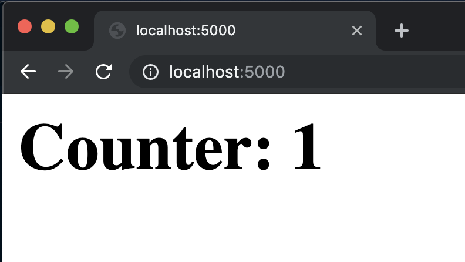

# A Quart Database Counter <!-- 4 -->

## ORMs and Async <!-- 4.1 -->

In the next few lessons, we’ll build a counter app that will be a good boilerplate application for your Postgres-based Quart projects.

But before we start writing the application, we need to understand one of the many quirks we’ll see when working with asynchronous applications, and this one is related to database ORMs.

For our original Flask database boilerplate application, we used SQLAlchemy ORM, the Python Database Object Relational Mapper. However, for async projects we can’t use the same library without some form of penalization.

Flask-SQLAlchemy does work with Quart using the `flask_patch` function we discussed earlier, but it doesn't yield to the event loop when it reads or writes. This will mean it cannot handle much concurrent load — [only a couple of concurrent requests](https://gitter.im/python-quart/lobby?at=5cd1da132e2caa1aa625ef83).

However, we don’t need to go back to using raw SQL queries in our codebase. It just happens that we can use the SQLAlchemy Core package from SQLAlchemy, which allows us to express queries in a nice way without sacrificing performance.

We’ll also be using the [`databases`](https://www.encode.io/databases/) package to connect to Postgres asynchronously.

So let’s go ahead and start coding our Quart Postgres counter application.

## Our Development Environment <!-- 4.2 -->

We now need two services to be running for our application: the Quart web server and a Postgres database server to store our data.

We have two main choices: develop locally or on the cloud.

For local development, we'll see how to install Postgres on Mac or Windows machines. We'll also take a look at the Windows Subsystem for Linux, which allows you to run a Linux container natively in your Windows computer.

We can also develop locally using Docker, which is host OS agnostic.

For the cloud, we have a new option that I've been really happy with: Github Codespaces. Although it's offered on paid plans, it's a great option if you have high speed internet and can afford to pay around $5 dollars per month.

Skip to the one that works for you.

### Installing Postgres on Mac with Homebrew <!-- 4.2.1 -->

Thanks to Homebrew installing MySQL on the Mac is pretty simple.

If you don’t have Homebrew, please follow the instructions [on their page](https://brew.sh).

Just do the following:
`brew install postgresql`

If you want Postgres to launch automatically whenever you power on your Mac, you can do: `brew services start postgresql`. I really don’t recommend that. Instead you can start it manually when you need it by doing `pg_ctl -D /usr/local/var/postgres start` and stopping with `pg_ctl -D /usr/local/var/postgres stop`.

Let’s check if Postgres is working. Start the server and log in using `psql postgres`. Exit using `\q`

It’s a good practice to create the database with a specific user and password and not use the root user from the application.

We will create a database called "app". We will access this database with the user "app_user" and the password "app_password".

So, login to Postgres with your root user:
`psql postgres`.

Create the `app_user` with its password: `CREATE ROLE app_user WITH LOGIN PASSWORD 'app_password';`.

Give the user database creation permissions: `ALTER ROLE app_user CREATEDB;`.

Logout using `\q` and now login using the `app_user` by doing `psql postgres -Uapp_user`.

Next, we'll create the app database: `CREATE DATABASE app;`.

You can check that the database was created by using the "list" command: `\l`. You should see that the `app` database is owned by the `app_user`.

You can now connect to the database using `\connect app;` or `\c app` and list the tables using `\dt`.

Logout using `\q`

### Installing Postgres on Windows with Chocolatey <!-- 4.2.2 -->

Thanks to Chocolatey, installing Postgres on Windows is pretty simple.

If you don’t have Chocolatey, please follow the instructions [on their page](https://chocolatey.org/).

Open a PowerShell as an administrator and type:
`choco install postgresql --params '/Password:rootpass`. In this case we're creating root password of "rootpass", but select any password you'd like.

Now close the PowerShell application completely and open a new, regular session.

Let’s check if Postgres is working. Log in using `psql postgres postgres`. Exit using `\q`.

It’s a good practice to create the database with a specific user and password and not use the root user from the application.

We will create a database called "app". We will access this database with the user "app_user" and the password "app_password".

So, login to Postgres with your root user:
`psql postgres postgres`.

Create the `app_user` with its password: `CREATE ROLE app_user WITH LOGIN PASSWORD 'app_password';`.

Give the user database creation permissions: `ALTER ROLE app_user CREATEDB;`.

Logout using `\q` and now login using the `app_user` by doing `psql postgres -Uapp_user`.

Next, we'll create the app database: `CREATE DATABASE app;`.

You can check that the database was created by using the "list" command: `\l`. You should see that the `app` database is owned by the `app_user`.

You can now connect to the database using `\connect app;` or `\c app` and list the tables using `\dt`.

Logout using `\q`.

### Installing Postgres on WSL <!-- 4.2.3-->

In 2016, Windows gave a big surprise to developers by announcing the Windows Subsytem for Linux, or WSL, which allowed the user to run a real Linux OS instance in a native and seamless way inside Windows.

In 2019, WSL 2 was announced which brought important changes, the most important one being the ability to run a real Linux kernel through the Windows virtualization engine, Hyper-V.

Installing WSL requires Windows 10 version 2004, and it's really easy, just open an administrator Powershell and type the following command: `wsl --install`.

After that, you need to select a Linux distribution to install. You can see a list of the distributions by typing: `wsl --list --online`.

I personally recommend using Ubuntu, so to install it, we can do: `wsl --install -d Ubuntu-20.04`. You will be prompted to create a root user password.

Once you have Ubuntu, I recommend that you install the new [Windows Terminal](https://www.microsoft.com/en-us/p/windows-terminal/9n0dx20hk701?activetab=pivot:overviewtab), which allows you to open a WSL terminal really easily by selecting Ubuntu from the drop down.

Once on the Ubuntu terminal, let's install some of our dependencies.

First elevate to root by doing `sudo su -` and then type the following:

{lang=bash,line-numbers=off}

```
apt-get update && apt-get install -y \
    build-essential \
    make \
    gcc \
    git \
    unzip \
    wget \
    python3-dev \
    python3-pip
```

We need `poetry` for the Python package management, so install Poetry using `pip3 install poetry`.

Then install Postgres by using: `sudo apt install -y postgresql`.

After installing, we can start postgres. First exit from root by typing `exit`. You should see your user in the command propmt.

Then start Postres by doing: `sudo service postgresql start`.

It’s a good practice to create the database with a specific user and password and not use the root user from the application.

We will create a database called "app". We will access this database with the user "app_user" and the password "app_password".

So, login to Postgres with the `postgres` user by doing:
`sudo -u postgres psql`.

Create the `app_user` with its password: `CREATE ROLE app_user WITH LOGIN PASSWORD 'app_password';`.

Give the user database creation permissions: `ALTER ROLE app_user CREATEDB;`.

Logout using `\q` and now login using the `app_user` by typing the following: `psql -h localhost -U app_user postgres`. Enter the password: `app_password` when prompted.

Next, we'll create the app database: `CREATE DATABASE app;`.

You can check that the database was created by using the "list" command: `\l`. You should see that the `app` database is owned by the `app_user`.

You can now connect to the database using `\connect app;` or `\c app` and list the tables using `\dt`.

Logout using `\q`.

### Docker Setup <!-- 4.2.4 -->

In this lesson we'll be setting up our development environment using Docker.

You need to download the Docker desktop client for Windows or Mac, which you can find in the [Docker website](https://www.docker.com/products/docker-desktop). Just follow the instructions.

Once you have Docker client running, let's start by creating our `Dockerfile`.

First, create the directory where the application will live. You can create this directory inside your user's home directory.

If you plan to use a diretory outside your personal folder and you are a Mac user, you will need to add it to the Docker client file sharing resouces on preferences.

So I'll call mine `counter_app` -- so I will do `mkdir counter_app`.

Now `cd` into your application folder and open a code editor to create the `Dockerfile`. It looks like this:

{lang=yml,line-numbers=on,starting-line-number=1}

```
FROM ubuntu:20.04

# Install packages
RUN apt-get update && apt-get install -y \
    build-essential \
    make \
    gcc \
    git \
    unzip \
    wget \
    python3-dev \
    python3-pip \
    python-is-python3

ENV PIP_DISABLE_PIP_VERSION_CHECK=on

# Install poetry
RUN pip3 install poetry

# set "counter_app" as the working directory from which CMD, RUN, ADD references
WORKDIR /counter_app

# setup poetry
COPY pyproject.toml /counter_app/
RUN poetry config virtualenvs.create true \
    && poetry config virtualenvs.in-project false \
    && poetry install --no-interaction

# now copy all the files in this directory to /code
COPY . .

# Listen to port 5000 at runtime
EXPOSE 5000

# Define our command to be run when launching the container
CMD poetry run quart run --host 0.0.0.0
```

First we define the base image as the Ubuntu 20.04 image.

Next we install all the Ubuntu packages we will need. We'll also turn off the disruptive pip version check prompts.

Next, we install Poetry using `pip3`.

We then create the `counter_app` directory in the Docker instance and set it as the default location for the code.

At this point we need to set up Poetry, so we copy both the `pyproject` and the `poetry.lock` files to prepare to install. We then set come flags for Poetry to work best and install all the packages.

Right after that, we copy the contents of the local directory into the `counter_app` directory using the `COPY` command.

Once all the code in is place, we open the `5000` port and invoke the `poetry run` command.

Save the file.

Now we need to create a `docker-compose` file that will build up both our application instance as well as the Postgres instance.

We will create the services using the following `docker-compose.yml` file:

{lang=yml,line-numbers=on,starting-line-number=1}

```
version: "2"
services:
  web:
    build: .
    ports:
      - "5000:5000"
    volumes:
      - ./:/counter_app
    links:
      - db:postgres
    container_name: app_web_1
    depends_on:
      - db
    stdin_open: true
    tty: true
    environment:
      PORT: 5000
      SECRET_KEY: "you-will-never-guess"
      DEBUG: 1 # can't pass True here, but 1 works
      DB_USERNAME: app_user
      DB_PASSWORD: app_password
      DB_HOST: postgres
      DATABASE_NAME: app
```

First we describe the Docker Compose file version as "2". We then start defining the services, which are essentially the containers that will be running at the same time.

The first service is the web application which we are calling `web`. We instruct Docker Compose to build the container using the `Dockerfile` in the same directory using the `build .` statement.

Next we open up port 5000 both in the host as well as in the container, as this will be the port that Quart is assigned to listen on.

Then we mount the current host's (Windows or Mac computer)directory as a volume inside the container, which will be aliased `counter_app`. This will allow us to code on the host machine and propagate those changes in the container instantly.

The `links` statement describes that this container is connected to another service which we will call `db`, but inside the container it will be reachable as `postgres`.

We then assign the name of the container to be `app_web_1` and instrust Docker Compose that it depends on the `db` service to be up.

The next two statements, `stdin_open` abd `tty` are added so that we can execute the Python debugger and examine it from outside the container.

The rest of the file is the environment variables. As you can see they are the same ones defined on the `.quartenv` file.

Next we'll define the Postgres database docker instance:

{lang=yml,line-numbers=on,starting-line-number=24}

```
  db:
    image: postgres:13-alpine
    restart: always
    container_name: app_db_1
    ports:
      - "5432:5432"
    environment:
      POSTGRES_USER: app_user
      POSTGRES_PASSWORD: app_password
      POSTGRES_DB: app
```

This is file is pretty much self-explanatory. We will use the Postgres 13 alpine image, instruct the container to always restart, put a name for it and open port 5432 to the host, which is the standard Postgres port.

Save the file.

We won't start the Docker container yet, as we need a couple of more things in place.

## Initial Setup <!-- 4.3 -->

So let’s go ahead and start setting up our Quart counter application. Like I’ve done in other courses, we’re going to build a web application that stores a counter in the database and increases it by one every time you reload the page. This will allow us to see how a typical Quart database application is laid out.

One new thing we’ll use here is Alembic for database migrations. Alembic is what powers Flask-Migrations under the hood. Even though it’s a bit more complicated to set it up the first time, we will be using this application as a boilerplate when we create other database-driven Quart applications down the road, so we won’t have to repeat the setup from scratch again.

Start by creating the folder for the project. I'll name mine `counter_app`. Change to that directory.

Change to the directory, and let's initialize the Poetry environment with Quart and python-dot-env. You should have Poetry installed from the previous module, but if you haven't go ahead and install it by following the instructions [on this page](https://python-poetry.org/docs/#installation).

So do: `poetry init -n --name counter_app --python ^3.7 --dependency quart@0.15.1 --dependency python-dotenv@0.10.1`.

This will write the `pyproject` but won't install the packages.

Now let's create the Quart environment variables that will be loaded to our environment by `python-dotenv`.

So create the `.quartenv` file and type the following code:

{lang=python,line-numbers=on}

```
QUART_APP='manage.py'
QUART_ENV=development
SECRET_KEY='my_secret_key'
DB_USERNAME=app_user
DB_PASSWORD=app_password
DB_HOST=localhost
DATABASE_NAME=app
```

First, the `QUART_APP` will be small kickstarter `manage.py` file that creates an instance of our application using the Factory pattern, just like I’ve done previously on my Flask course.

Next the `QUART_ENV` environment we’ll define as `development` so that we have meaningful error pages. We’ll also add a `SECRET_KEY`; even though it’s not essentially needed, it’s a good practice to have it.

The next five variables, `DB_USERNAME`, `DB_PASSWORD`, `DB_HOST`, and `DATABASE_NAME` will allow us to connect to the database. We'll use a generic `app` prefix for the user, password and database so that we don't have to worry when we use the same code for other applications.

Save the file.

We’ll now need to create a `settings.py` file, so we’ll use very similar variables from the `.quartenv` with the following format:

{lang=python,line-numbers=on}

```
import os

SECRET_KEY = os.environ["SECRET_KEY"]
DB_USERNAME = os.environ["DB_USERNAME"]
DB_PASSWORD = os.environ["DB_PASSWORD"]
DB_HOST = os.environ["DB_HOST"]
DATABASE_NAME = os.environ["DATABASE_NAME"]
```

As we saw earlier, `python-dotenv` will load the variables In `.quartenv` and load it as environment variables in our computer, so then `settings.py` can access them using `os.environ`. We do this so that we can then deploy to a production environment easily with the proper environment variables set in the production hosts. Save the file.

## Application Setup <!-- 4.4 -->

At this point we’re ready to start building our Quart counter application. You should have the Postgres server up and running with your counter database and user.

We’ll install some database packages we will need. The first is `psycopg2-binary`, a library that allows Python applications to connect to Postgres databases. We'll also install the `databases` package that allows async connection to databases.

The third, as we mentioned earlier, is the SQLAlchemy library, but even though we’ll install the whole package, we’ll be using the Core module for our application.

So open the `pyproject.toml` file and add the following on the `[tool.poetry.dependencies]` section:

{lang=python,line-numbers=on,starting-line-number=12}

```
psycopg2-binary = "2.9.1"
databases = {version = "0.4.1", extras = ["postgresql"]}
sqlalchemy = "1.4"
```

Once that’s done, we’ll go ahead and create our database driver file, so go ahead and create a new file we’ll call `db.py`.

{lang=python,line-numbers=on}

```
from databases import Database
from quart import current_app
import sqlalchemy

metadata = sqlalchemy.MetaData()


async def db_connection():
    database_url = f"postgresql://{current_app.config['DB_USERNAME']}:"
    database_url += f"{current_app.config['DB_PASSWORD']}@"
    database_url += f"{current_app.config['DB_HOST']}:5432/"
    database_url += f"{current_app.config['DATABASE_NAME']}"
    database = Database(database_url, min_size=5, max_size=20)

    return database
```

First we will import the `Datbase` class from the `databases` package, which gives us asynchronous connection to our Postgres instance.

We’ll also need to import the `current_app` from `quart`. Think of the `current_app` as the currently running instance of the Quart application. We’ll need it to read the settings that we’ve set for the database connection.

Finally, we will import the `sqlalchemy` package to define an application-wide `metadata` object that will track all the models in our application which will allow us to manage migrations when we start using `alembic`.

Next, let’s create the database connection using the user, password, host and database from those settings. Finally we acquire the connection and return it to the caller.

Save the file.

Now let’s go ahead and create our first and only blueprint of the application, the `counter` module.

First, create the `counter` folder and inside create the empty `__init__.py` to declare it a module.

Then create the `models.py` file with the following contents:

{lang=python,line-numbers=on}

```
from sqlalchemy import Table, Column, Integer

from db import metadata

counter_table = Table(
    "counter",
    metadata,
    Column("id", Integer, primary_key=True),
    Column("count", Integer),
)
```

We’ll begin by importing some modules from `sqlalchemy`. The names might sound familiar: `Table` allows us to setup a table in the database, `Column` allows us to create the table columns and `Integer` which is the only column type we use.

We also import our `metadata` object which will allow us to do introspection about the table schema when we use migrations. You need this object in any model you create.

Then, we define our `counter_table` as a table consisting of two columns: our `id` which will be the primary key and `count` which will hold the current counter of the application. Notice we define the table name as `counter` and add the `metadata` object as part of the definition.

Save the file.

Now let’s go ahead and build the `views.py` file which will be our main controller and blueprint.

{lang=python,line-numbers=on}

```
from quart import Blueprint, current_app, Response

from counter.models import counter_table

counter_app = Blueprint("counter_app", __name__)


@counter_app.route("/")
async def init() -> str:
    conn = current_app.dbc  # type: ignore
    counter_query = counter_table.select()
    result = await conn.fetch_all(query=counter_query)
    count = None

    if not len(result):
        stmt = counter_table.insert().values(count=1)
        result = await conn.execute(stmt)
        await conn.execute("commit")
        count = 1
    else:
        row = result[0]
        count = row["count"] + 1
        counter_update = counter_table.update(
            counter_table.c.id == row["id"]
        ).values({"count": count})
        result = await conn.execute(counter_update)
        await conn.execute("commit")
    return "<h1>Counter: " + str(count) + "</h1>"
```

We’ll import `Blueprint` to create the `counter_app` blueprint as well as the `current_app` which we'll need to get the database connection.

We’ll also import our `counter_table` from our model file.

So let’s define the blueprint itself, `counter_app`.

The only route this controller has is the root slash, which will call the `init` function.

We begin by fetching our database connection from the `current_app.dbc`.

Next we build a query which will select all the records in the `counter_table` . In this application it will always be just one record as you’ll see below. We’ll get more familiar with the `select` function from `sqlalchemy`, but for now just think of this as doing a `SELECT * FROM counter_table`.

We then feed the result of the query to the `result` variable, but notice the use of the `await` keyword there. Indeed the connection execution is an asynchronous operation that will resolve into a coroutine which will eventually resolve with the data we need.

We’ll also set an internal variable of `count` to `None`.

We then get to the main forking point of the script. If we don’t get any results from the query, it means it’s the first time we’re running the application, so we’ll build an insert statement, setting the value of the `count` column to `1`. We’ll then `await` the insert statement and store the results in the `result` variable and finally commit it to the database, again using an `await` operation. Since this is the first time we run the application, we can safely say that the `count` variable is `1`.

Now, on the else statement, if do get a result from the select query, we will fetch the first row of the result. We then add `1` to the contents of the `count` column and store it in the local `count` variable.

We then build an update statement with the value of the local `count` variable, execute it and commit it.

Finally we return the value of the `count` variable to the request as HTML content.

As you can already notice, any database connection operations must be awaited, since they are I/O operations that can yield to the event loop.

Save the file.

Next we’ll create the application factory, as we’ve done in the past in my Flask course. Call this file `application.py`.

{lang=python,line-numbers=on}

```
from quart import Quart

from db import db_connection


def create_app(**config_overrides):
    app = Quart(__name__)

    # Load config
    app.config.from_pyfile("settings.py")

    # apply overrides for tests
    app.config.update(config_overrides)

    # import blueprints
    from counter.views import counter_app

    # register blueprints
    app.register_blueprint(counter_app)

    @app.before_serving
    async def create_db_conn():
        database = await db_connection()
        await database.connect()
        app.dbc = database

    @app.after_serving
    async def close_db_conn():
        await app.dbc.disconnect()

    return app
```

We begin by importing `Quart` and the `db_connection` variable from the `db` file we created earlier.

Next, we define the factory variable as `create_app` with a `config_overrides` parameter that will allow our tests to change the settings environment variables when running them.

We then begin by creating an `app` instance of Quart and configure the app from the `settings.py` file contents. Then, update the app with any changes passed on the `config_overrides` parameter.

After that we import the `counter_app` blueprint from the `views.py` file and register it.

We now need a way for the application to open a reusable connection to the MySQL database server. For that we’ll use a couple of special decorators called `before_serving` and `after_serving`. These decorators setup functions to be executed the first time the application is started and right before the application will be closed, which allows us to open the connection once and keep it open for all requests, without needing to close and open it on a per-request basis.

For the `before_serving` function, we’ll `await` a database connection. We then store this connection in a context variable called `dbc` that will be available anywhere you call the `current_app` in any view or model.

Finally, with the `after_serving` function, we’ll close the database connection properly, so any pending database requests are taken care of.

Save the file.

We’re almost done with the core application. We just need to create the bootstrap file that will spawn an instance of the application factory. We’ll call this file `manage.py`.

This is a simple file. We just need to import the `create_app` function and then execute it and store it in a variable called `app`.

{lang=python,line-numbers=on}

```
from application import create_app

app = create_app()
```

Save the file and let’s go ahead and start with the database migration configuration.

## Configuring Alembic Migrations <!-- 4.5 -->

We’re now going to install Alembic to be able to do database migrations. If you’re not familiar with migrations, it’s just a way to track model changes in your codebase, so that other team members and the different environments can keep up to date as you change your database schema.

So we’ll install Alembic by adding it to the `pyproject.toml` as follows:

{lang=bash,line-numbers=on,starting-line-number=14}

```
alembic = "1.6.5"
```

We will now initialize the migration setup which will create both an `alembic.ini` and a `migrations` folder.

First, we need to install all the Poetry packages we've added. The command is different if are using Docker or if you are running Postgres locally.

If you are doing local development on Mac or Windows, type:

{lang=bash,line-numbers=off}

```
$ poetry install
```

If you are using Docker, type the following:

{lang=bash,line-numbers=off}

```
$ docker-compose run --rm web poetry install
```

Now we're ready for our first migration. Again, the command is different if are using Docker or if you are running Postgres locally.

If you are doing local development on Mac or Windows, makre sure you are running Postgres, and then type:

{lang=bash,line-numbers=off}

```
$ poetry run alembic init migrations
```

If you are using Docker, type the following:

{lang=bash,line-numbers=off}

```
$ docker-compose run --rm web poetry run alembic init migrations
```

You’ll notice there's a new file, `env.py` inside a new `migrations` folder.

## TODO: Continue here...

We need to tell `alembic` three things.

- First, we need it to use our environment variables to connect to the database.
- Second we need to tell it what models our application uses and finally,
- We need to tell it how to connect to the database.

So let’s begin setting up the environment variables in the `migrations/env.py` file.

Add the following at the top before `logging.config`:

{lang=python,line-numbers=on}

```
import os, sys
from dotenv import load_dotenv
from pathlib import Path
```

We’ll need all these libraries for the next step.

Then add this under `from alembic import context` on line 10:

{lang=python,line-numbers=on,starting-line-number=12}

```
# Path ops
parent = Path(__file__).resolve().parents[1]
load_dotenv(os.path.join(parent, ".quartenv"))
sys.path.append(str(parent))
```

The `parent` variable will figure out the parent folder so that we can fetch the `.quartenv` file location and pass it to the `python-dotenv` and finally we add that parent folder to the `sys.path` so that Alembic has access to it.

Then on line 35 right before the `run_migrations_offline` function, let’s add the following:

{lang=python,line-numbers=on,starting-line-number=35}

```
section = config.config_ini_section
config.set_section_option(section, "DB_USERNAME", os.environ.get("DB_USERNAME"))
config.set_section_option(section, "DB_PASSWORD", os.environ.get("DB_PASSWORD"))
config.set_section_option(section, "DB_HOST", os.environ.get("DB_HOST"))
config.set_section_option(section, "DATABASE_NAME", os.environ.get("DATABASE_NAME"))
```

We’re giving the `alembic.ini` file, which we’ll edit in a little bit, access to the environment variables.

Now we can move to step 2, tell Alembic what models we have in our application. So on line 25 let’s replace that whole block with the following:

{lang=python,line-numbers=on,starting-line-number=25}

```
# import all application models here
from counter.models import metadata as CounterMetadata

# and then add them here as a list
target_metadata = [CounterMetadata]
```

This is very important to remember: any new models you add subsequently, you need to add them here.

Save the file[^2].

With all that in place, we’ll finally move to the last step: tell Alembic how to connect to the database.

Open the `alembic.ini` file and change `sqlalchemy.url` on line 38 like this.

{lang=python,line-numbers=on,starting-line-number=38}

```
sqlalchemy.url = mysql+pymysql://%(DB_USERNAME)s:%(DB_PASSWORD)s@%(DB_HOST)s:3306/%(DATABASE_NAME)s
```

These variables are coming from the `env.py` we edited earlier. Save the file[^3].

And with this, we’re ready to run our first migration.

[^1]: https://github.com/fromzeroedu/quart-mysql-boilerplate/tree/step-4
[^2]: https://github.com/fromzeroedu/quart-mysql-boilerplate/blob/step-5/migrations/env.py
[^3]: https://github.com/fromzeroedu/quart-mysql-boilerplate/blob/step-5/alembic.ini

## Our First Migration <!-- 4.6 -->

We’re now ready to create the tables in the database using the Alembic migration workflow. You will notice that the commands look a bit like Git commands. Initially you’ll need to write these down, but once you do it a couple of times, you’ll remember them.

So we’ll create our first “migration commit”. It will be different if you are using Docker or not, so don't type anything yet.

For local development we will use:

{lang=bash,line-numbers=off}

```
$ poetry run alembic revision --autogenerate -m "create counter table"
```

For Docker, you will use:
{lang=bash,line-numbers=off}

```
docker-compose run --rm web poetry run alembic revision --autogenerate -m "create counter table"
```

However, if you are using Docker, you need to build the environment first, so type `docker-compose up --build`. You will see the Postgres image and the Quart container being built. After a few seconds you should see that the container is up and running.

After this one time, to start the environment, you can omit the `--build` flag. You only need it if you have changed the Dockerfile, `docker-compose` file or added new Poetry packages.

So press `CTRL-C` to stop the containers.

Thanks to the `target_metadata` setting we added earlier, Alembic can view the status of the database and compare against the table metadata in the application, generating the “obvious” migrations based on a comparison. This is achieved using the `--autogenerate` option to the alembic revision command, which places so-called candidate migrations into our new migrations file.

Make sure your MySQL server is up and running, then execute the migration command according to your environment, and you should see something like the following:

{lang=bash,line-numbers=off}

```
$ poetry run alembic revision --autogenerate -m "create counter table"
INFO  [alembic.runtime.migration] Context impl Postgres.
INFO  [alembic.runtime.migration] Will assume non-transactional DDL.
INFO  [alembic.autogenerate.compare] Detected added table 'counter'
  Generating /opt/quart-mysql-
  boilerplate/migrations/versions/2abbbb3287d2_create_counter_table.py ... done
```

Check that a new `versions` file[^1] was created and take a look:

{lang=python,line-numbers=on}

```
"""create counter table

Revision ID: 2abbbb3287d2
Revises:
Create Date: 2019-09-19 10:46:47.608330

"""
from alembic import op
import sqlalchemy as sa


# revision identifiers, used by Alembic.
revision = '2abbbb3287d2'
down_revision = None
branch_labels = None
depends_on = None


def upgrade():
    # ### commands auto generated by Alembic - please adjust! ###
    op.create_table('counter',
    sa.Column('id', sa.Integer(), nullable=False),
    sa.Column('count', sa.Integer(), nullable=True),
    sa.PrimaryKeyConstraint('id')
    )
    # ### end Alembic commands ###


def downgrade():
    # ### commands auto generated by Alembic - please adjust! ###
    op.drop_table('counter')
    # ### end Alembic commands ###
```

As you can see, there are three sections: one that holds what revision this is and how to get to the previous one, an `upgrade` list of commands and a `downgrade` list of commands. Always take a look at the newest revision file so that you can spot any inconsistencies or issues.

This looks good to me, so let’s apply these changes on the database by doing:

{lang=bash,line-numbers=off}

```
$ pipenv run alembic upgrade head
INFO  [alembic.runtime.migration] Context impl MySQLImpl.
INFO  [alembic.runtime.migration] Will assume non-transactional DDL.
INFO  [alembic.runtime.migration] Running upgrade  -> 2abbbb3287d2, create counter table
```

Great, it went smoothly which means the tables were created. We can log in into MySQL and check the tables.

{lang=mysql,line-numbers=off}

```
mysql> use counter;
mysql> show tables;
+-------------------+
| Tables_in_counter |
+-------------------+
| alembic_version   |
| counter           |
+-------------------+
2 rows in set (0.00 sec)
```

We can see the counter table was created, but notice there’s an `alembic_version` table. This table holds the current migration version.

{lang=mysql,line-numbers=off}

```
mysql> select * from alembic_version;
+--------------+
| version_num  |
+--------------+
| 2abbbb3287d2 |
+--------------+
1 row in set (0.00 sec)
```

That hash matches with our latest revision value:

{lang=python,line-numbers=off}

```
# revision identifiers, used by Alembic.
revision = '2abbbb3287d2'
```

Exit the MySQL server and we should be ready to run our application. Just do:

{lang=bash,line-numbers=off}

```
$ pipenv run quart run
Running on http://127.0.0.1:5000 (CTRL + C to quit)
starting app
Running on 127.0.0.1:5000 over http (CTRL + C to quit)
```

If you open `localhost:5000` you will see the first number of our counter:



Refreshing the page will increase the counter value. And there you have it, your first Quart database-driven application.

[^1]: https://github.com/fromzeroedu/quart-mysql-boilerplate/blob/step-5/migrations/versions/2abbbb3287d2\_create\_counter\_table.py

## Testing our Counter Application <!-- 4.7 -->

It’s great that we have a running application, but we know that any application needs good tests to insure it won’t break with new development.

In our synchronous applications we had used `unittest`, but for asynchronous applications, I’ve found that `pytest` is a better fit. `Pytest` also has an `asyncio` library that will allow us to test our code better.

So let’s begin by adding those libraries to the application. So just do:

{lang=bash,line-numbers=off}

```
$ pipenv install pytest pytest-asyncio
```

Ok, with that out of the way let’s see how `pytest` works.

The `pytest` library works in a modular fashion using reusable functions called _fixtures-_. Fixtures allow you to put the repetitive stuff in one function and then add them to the tests that need them.

The cool thing about theses fixtures is that they can be used in a layered format, allowing you to build very complex foundations. Unfortunately this is also `pytest`’s Achilles’ heel, as some teams make such complex “fixture onions” that will make any newcomer spend lots of time to learn them. My recommendation is to always make tests as readable as possible, so avoid doing more than three layers of fixtures and keep them as single-purpose as possible with very descriptive names.

These fixtures can live in the same test files that use them or you can put them in a special file called `conftest`. Any `conftest` fixtures on a parent directory are available to the tests in the child directories. You’ll get the hang of it as you start building your tests.

The other difference with `unittest` is that `pytest` doesn’t require classes, although they can still be used.

So let’s create our first `conftest` file. Create it on the root application folder.

First, we’ll add the necessary imports we’ll use.

{lang=python,line-numbers=on}

```
import pytest
import asyncio
import os
from dotenv import load_dotenv
from sqlalchemy import create_engine

load_dotenv(".quartenv")

from application import create_app
```

Make sure to place the `load_dotenv` command before the `create_app` factory instantiation so that the environment variables are set.

We will now create the database instantiation part of our test, so let’s write that:

{lang=python,line-numbers=on,starting-line-number=13}

```
@pytest.mark.asyncio
@pytest.fixture(scope="module")
async def create_db():
    print("Creating db")
    db_name = os.environ["DATABASE_NAME"] + "_test"
    db_host = os.environ["DB_HOST"]
    db_root_password = os.environ["MYSQL_ROOT_PASSWORD"]
    if db_root_password:
        db_username = "root"
        db_password = db_root_password
    else:
        db_username = os.environ["DB_USERNAME"]
        db_password = os.environ["DB_PASSWORD"]

    db_uri = "mysql+pymysql://%s:%s@%s:3306" % (db_username, db_password, db_host)

    engine = create_engine(db_uri)
    conn = engine.connect()
    conn.execute("CREATE DATABASE " + db_name)
    conn.execute("COMMIT")
    conn.close()

    yield {
        "DB_USERNAME": db_username,
        "DB_PASSWORD": db_password,
        "DB_HOST": db_host,
        "DATABASE_NAME": db_name,
        "DB_URI": db_uri,
        "TESTING": True,
    }

    print("Destroying db")
    engine = create_engine(db_uri)
    conn = engine.connect()
    conn.execute("DROP DATABASE " + db_name)
    conn.execute("COMMIT")
    conn.close()
```

First we need two decorators: one called `mark.asyncio` which will tell `pytest` that we have async operations in the test or fixture.

We also need to tell `pytest` that this is a module-level fixture, which means it will be run only once across any modules that import it, and since this `conftest` is in the root folder of the application, it means it will only be run once for all our tests, and that makes sense: we only need to create the test database once.

We then load the credentials from the `dotenv` file. Notice how we have an if/else block that uses the root password if it’s present. If you took my Flask course, you know this is necessary for cloud development IDEs like PythonAnywhere where we don’t have root access. We then connect to the database and create the test database.

Now here’s something you will see often with `pytest` fixtures and that’s the use of the `yield` statement. We’re going to yield the application settings to the next test or fixture that includes it.

Essentially what yield does is to send the control back to the calling test, and you can define what data you want to share with it here. Once the test is completed, the rest of the commands below the yield are executed, so we will write the database cleanup commands in here. We’ll put some print statements to see the order of operations when we run the tests so we can have a better picture of how the fixture is executed.

Next, let’s create the Quart application itself.

{lang=python,line-numbers=on,starting-line-number=55}

```
@pytest.fixture(scope="module")
async def create_test_app(create_db):
    app = create_app(**create_db)
    await app.startup()
    yield app
    await app.shutdown()
```

This also needs to be a module-level fixture and we will inject the `create_db` fixture to it as a dependency. That’s right, you can inject fixtures in other fixtures — but again, remember to limit the number of fixture layers to keep your tests manageable, like I mentioned earlier.

We then create an instance of the factory `create_app` function and then call the Quart app method `startup` which will run the `before_serving` decorated function, which in our app establishes the database connection.

{lang=python,line-numbers=on,starting-line-number=22}

```
    @app.before_serving
    async def create_db_conn():
        print("Starting app")
        app.sac = await sa_connection()
```

We then yield the app itself to the calling test and once the tests are done, we do the `shutdown` method of the Quart app which calls the `after_serving` function in our `application.py`.

{lang=python,line-numbers=on,starting-line-number=27}

```
    @app.after_serving
    async def close_db_conn():
        print("Closing down app")
        await app.sac.close()
```

One thing I want you to notice, in the instantiation of the `create_app` we are passing the `create_db` fixture returned with a double asterisk in front of it:

{lang=python,line-numbers=on,starting-line-number=57}

```
app = create_app(**create_db)
```

The way this works is that the `create_db` fixture is returning a dictionary of variables which line up with our settings variables. Remember how `create_app` takes overrides as a parameter?

{lang=python,line-numbers=on,starting-line-number=13}

```
    # apply overrides for tests
    app.config.update(config_overrides)
```

This is exactly why, so that we can instantiate test apps with different configuration settings. The double asterisk in Python essentially passes the variables returned by `create_db` as a keyword argument list, so it’s the same as writing the following:

{lang=python,line-numbers=on,starting-line-number=57}

```
app = create_app(DB_USERNAME=create_db['DB_USERNAME'], DB_PASSWORD=create_db['DB_PASSWORD']...)
```

We’re almost there. We’ll create our last fixture, which will allow us to create a test client that we can use to hit the endpoints. This looks like this:

{lang=python,line-numbers=on,starting-line-number=63}

```
@pytest.fixture
def create_test_client(create_test_app):
	print("Creating test client")
    return create_test_app.test_client()
```

We will inject the `create_test_app` fixture from above. Yes, that means we’re already at two fixture levels from the first fixture in the file, but this is the only fixture we will need in our tests, so we’re good.

We don’t need to yield anything in this case since we don’t need to run any cleanups after the test is done. Also notice this is not a module-level fixture which means it will be executed with every test that calls it.

Save the file[^1].

Now let’s create our actual test. Create a file called `test_counter` inside the `counter` folder. Any file that starts with the word `test_` will be automatically discovered by `pytest`.

{lang=python,line-numbers=on,starting-line-number=1}

```
import pytest
from quart import current_app
from sqlalchemy import create_engine, select

from counter.models import counter_table, metadata as CounterMetadata


@pytest.fixture(scope="module")
def create_all(create_db):
	print("Creating Counter Tables")
    engine = create_engine(create_db["DB_URI"] + "/" + create_db["DATABASE_NAME"])
    CounterMetadata.bind = engine
    CounterMetadata.create_all()

```

First we do the necessary imports. We’re going to need the counter models to create the database tables as well as access to their metadata.

So first let’s create a fixture that we’ll only need on this test which is to create the counter tables. We will make it a module-level fixture so that it can access the `create_db` properties (which is also a module level fixture).

To do that we create an engine, but notice we will use the dictionary object passed in the yield statement in `create_db` instead of using the actual settings, since this is this test’s custom settings.

We then bind that engine to the `CounterMetadata` object and finally execute the `create_all` method, which will create the counter tables on the database.

Finally we’re ready to create our very first test, so let’s keep it simple. We want to be able to see that the counter is started when we first hit the page.

{lang=python,line-numbers=on,starting-line-number=17}

```
@pytest.mark.asyncio
async def test_initial_response(create_test_client, create_all):
    response = await create_test_client.get("/")
    body = await response.get_data()
    assert "Counter: 1" in str(body)
```

We need to decorate it as an `asyncio` test, since we’ll be doing I/O operations. We’ll also need both the `create_test_client` fixture as well as the `create_counter_tables` fixture. We then hit the test client with a request and await for the response. The data we get back is stored in the `body` variable and then check that the string “Counter: 1” is in the body.

Save the file[^2] and run the test using `pipenv run pytest`.

{lang=bash,line-numbers=off}

```
$ pipenv run pytest
============================= test session starts ==============================
platform darwin -- Python 3.7.3, pytest-4.5.0, py-1.8.0, pluggy-0.13.0
rootdir: /opt/quart-mysql-boilerplate
plugins: asyncio-0.10.0
collected 1 item

counter/test_counter.py E                                                [100%]

==================================== ERRORS ====================================
___________________ ERROR at setup of test_initial_response ____________________
ScopeMismatch: You tried to access the 'function' scoped fixture 'event_loop' with a 'module' scoped request object, involved factories
counter/test_counter.py:9:  def create_counter_tables(create_db)
conftest.py:13:  def create_db(event_loop)
.venv/lib/python3.7/site-packages/pytest_asyncio/plugin.py:204:  def event_loop(request)
=========================== 1 error in 0.02 seconds ============================
```

It fails!

What’s the problem? The issue here is that `pytest` has a built-in function-level event loop that’s not persisted across functions, so we need to grab an event loop at the very top so that this one is persisted. Let’s add it on the `conftest` file.

{lang=python,line-numbers=on,starting-line-number=14}

```
@pytest.fixture(scope="module")
def event_loop(request):
    loop = asyncio.get_event_loop()
    yield loop
    loop.close()
```

Save the file[^3] and run the test again.

{lang=bash,line-numbers=off}

```
$ pipenv run pytest
============================= test session starts ==============================
platform darwin -- Python 3.7.3, pytest-4.5.0, py-1.8.0, pluggy-0.13.0
rootdir: /opt/quart-mysql-boilerplate
plugins: asyncio-0.10.0
collected 1 item

counter/test_counter.py .                                                [100%]

=========================== 1 passed in 0.19 seconds ===========================
```

Perfect! We now get a green line and the test passed label.

But if you notice, the print statements we added aren’t being printed. For those to be printed, you need to add a flag to the command, like so: `pipenv run pytest -s`.

{lang=bash,line-numbers=off}

```
 pipenv run pytest -s
============================= test session starts ==============================
platform darwin -- Python 3.7.3, pytest-4.5.0, py-1.8.0, pluggy-0.13.0
rootdir: /opt/quart-mysql-boilerplate
plugins: asyncio-0.10.0
collected 1 item

counter/test_counter.py Creating db
Creating Counter Tables
Starting app
Creating test client
.Closing down app
Destroying db


=========================== 1 passed in 0.11 seconds ===========================
```

This gives us a good insight of when things are called and the order of operations of our fixtures. Notice that the “Starting app” and “Closing down app” are coming from the `application.py` print statements.

We’ll add just one more test to mark this part complete. I want to evaluate if I hit the page a second time, I get the number two in the counter.

{lang=python,line-numbers=on,starting-line-number=24}

```
@pytest.mark.asyncio
async def test_second_response(
    create_test_app, create_test_client, create_counter_tables
):
    response = await create_test_client.get("/")
    body = await response.get_data()
    assert "Counter: 2" in str(body)
```

We’ll mark the test as async and we will also need the fixtures we used in the previous test as well as the `create_test_app` fixture itself, since we’ll be interacting with the application context.

First, we generate a response from the homepage and check if we get the “Counter: 2” label. Something you will notice different here as compared to the `unittest` library behavior we saw in the past is that the database is _not_ reset between tests. We would have to manually do that by calling the `CounterMetadata.drop_all()` method.

Let’s now check if the database has the right value. To do that, we need to interact with the models, which means we will need an app context. We’ll do that with the following:

{lang=python,line-numbers=on,starting-line-number=33}

```
    async with create_test_app.app_context():
        conn = current_app.sac
        counter_query = select([counter_table.c.count])
        result = await conn.execute(counter_query)
        result_row = await result.first()
        count = result_row[counter_table.c.count]
        assert count == 2
```

First we create an async context with the `with` Python keyword. Inside the block we can now get the Quart`current_app`context’s SQL connection object `sac`. We can then build the query, execute it, get the first row and then check that the count column’s value is equal to two.

Save the file[^4] and run the tests.

{lang=bash,line-numbers=on}

```
$ pipenv run pytest
============================= test session starts ==============================
platform darwin -- Python 3.7.3, pytest-4.5.0, py-1.8.0, pluggy-0.13.0
rootdir: /opt/quart-mysql-boilerplate
plugins: asyncio-0.10.0
collected 2 items

counter/test_counter.py ..                                               [100%]

=========================== 2 passed in 0.13 seconds ===========================
```

Looks good!

And with that we have a working MySQL based Quart application with testing. We can use this as a boilerplate for any project that uses Quart and MySQL.

[^1]: https://github.com/fromzeroedu/quart-mysql-boilerplate/blob/step-6/conftest.py
[^2]: https://github.com/fromzeroedu/quart-mysql-boilerplate/blob/step-6/counter/test\_counter.py
[^3]: https://github.com/fromzeroedu/quart-mysql-boilerplate/blob/step-7/conftest.py
[^4]: https://github.com/fromzeroedu/quart-mysql-boilerplate/blob/step-7/counter/test\_counter.py
