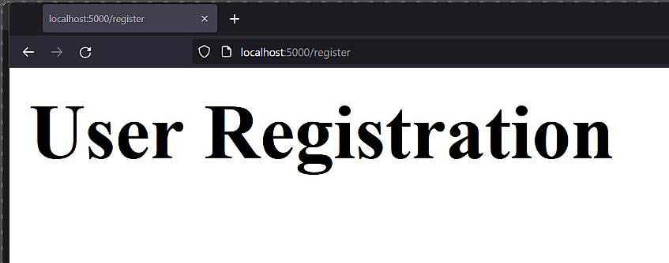

# QuartFeed, an SSE appplication using PostgreSQL <!-- 5 -->

## Introduction to Server Sent Events <!-- 5.1 -->
Server Sent Events, or SSEs, or EventSource in JavaScript, are an extension to HTTP that allow a client to keep a connection open to a server, thereby allowing the server to send events to the client as it chooses.

By default, the server sends updates with a `data` payload. You can also have an `event` type, which by default is `message`, but could be things like `add` or `remove`. Additionally it has an `id` parameter that allows the client to continue where it left off if the connection was lost.

We are going to build a lightweight version of the popular FriendFeed website, one of the pioneers in the social media space. using Quart and SSE.

For our FriendFeed clone we’ll have the event type to be either `post`, which is a new post, `like` if some one liked the post and `comment` if it’s a comment to a `post`.

For a more complex version or exercise to students, we could also have `groups`, which could be distinct `/sse` endpoints and `like` events for comments.

## QuartFeed Application Setup (step-0) <!-- 5.2 -->

So let's start setting up our QuartFeed application. 

To start, we can clone the Quart PostgreSQL Boilerplate code that we built in the previous lesson. You can grab the latest version from my [Github repo here](https://github.com/fromzeroedu/quart-postgres-boilerplate).

If you still have the code in your computer, like I do, you can just make a copy of it. Make sure to rename the folder to something like "quartfeed_app".

If you have cache files lying around after the copy, make sure to delete those folders.

We begin by installing the requirements. Edit `pyproject.toml` and change the name of the application to "quartfeed_app". [Save the file](https://fmze.co/fftq-5.2.7).

Next we install the poetry packages by doing: `poetry install`.

For local development I will leave the `.quartenv` as is, since they have generic names that we can use for any Quart application.

Now let's go ahead and rename the `counter` directory to `user` since that will be the first module we will be working on.

Next open the `models.py` file inside the new `user` folder.

Modify the file as follows.

{lang=python,line-numbers=on}
```
from sqlalchemy import Table, Column, Integer, String

from db import metadata

user_table = Table(
    "user",
    metadata,
    Column("id", Integer, primary_key=True),
    Column("username", String(15), index=True, unique=True),
    Column("password", String(128)),
)
```

First rename the table to `user_table` and change the table name, which is the first `Table` property to "user".

The `metadata` property will still come from the `db` module so leave that.

The first column, "id" will remain the same -- we still want that primary key in the table.

The second column we'll call "username". This is the first time we'll use the "String" `sqlalchemy` type, so let's add that to the import list on line 1. We'll define the length as `15` and then set the `index` property to `True` since we want to be able to search for users quickly using the `username` as a query, and finally we'll say that this column should be unique, since no two users should have the same username.

The next column is `password`, which is also a string with a length of 128 which coincides with the hashing algorithm we're going to use, which always generates a hash of 128 characters.

[Save the file](https://fmze.co/fftq-5.2.1).

Next, let's change the `user/views.py` file.

{lang=python,line-numbers=on}
```
from quart import Blueprint, current_app, Response

from user.models import user_table

user_app = Blueprint("user_app", __name__)


@user_app.route("/register")
async def register() -> str:
    return "<h1>User Registration</h1>"
```

On line 3, let's update the import to add the `user_table`.

Update line 5 to rename `counter_app` to `user_app`.

We actually don't need any of thie view function, so we'll go ahead and delete it.

On line 8 update the route to use the `user_app` and on line 9 we'll rename the function to `register` and we'll call this on the `/register` end point.

Finally we'll have this function just return the string "User Registration" just to make sure everything is working correctly.

[Save the file](https://fmze.co/fftq-5.2.2).

Let's go ahead and update the `application.py`. On line 16 and 19, update the `counter_app` to say `user_app`:

{lang=python,line-numbers=on,starting-line-number=15}
```
    # Import Blueprints
    from user.views import user_app

    # Register Blueprints
    app.register_blueprint(user_app)
```

[Save the file](https://fmze.co/fftq-5.2.3).

At this point, I want to make sure the application is running, by doing: `poetry run quart run`, and if I now go to `localhost:5000` on the `/register` endpoint, we can see that the application responds with the "User Registration" string, so all the routing seems to be working correctly.



If you are using VSCode, we can also use the run button on the editor, since we have the launcher files in our repository, and the nice thing with this approach is that we can set breakpoints and debug our application.

Ok, so let's start working on our migrations. The first thing we're going to do is go to the `migrations` folder and remove all files and directories from the `versions` folder, since these are all related to the `counter` app.

There's no need to change anytthing on the `alembic.ini` since we're using the same connection method.

Next, we'll take a look at the `env.py` on the `migrations` folder, and alll we need to do here is update the user model on line 27 like so:

{lang=python,line-numbers=on,starting-line-number=27}
```
from user.models import user_table
```

Also please remember if we add any new models, we need to add it here, so that the migrations script can detect any new schemas.

[Save the file](https://fmze.co/fftq-5.2.4).

So before we run the migration, we need to setup our Docker environment. So open the `Dockerfile` and change the references from `counter_app` to `quartfeed_app` in line 20 and 23.

{lang=python,line-numbers=on,starting-line-number=19}
```
# set "quartfeed_app" as the working directory from which CMD, RUN, ADD references
WORKDIR /quartfeed_app

# setup poetry
COPY pyproject.toml /quartfeed_app/
```

[Save the file](https://fmze.co/fftq-5.2.5) and next we'll update the `docker-compose.yml` with a similar change from `counter_app` to `quartfeed_app`:

{lang=python,line-numbers=on,starting-line-number=1}
```
version: "2"
services:
  web:
    build: .
    ports:
      - "5000:5000"
    volumes:
      - ./:/quartfeed_app
```

[Save the file](https://fmze.co/fftq-5.2.6).

If you still have the containers and the images from the counter app, go ahead and delete them: both the web app and the database app. You can use the Docker Desktop application or the VSCode plugin.

So go ahead and run `docker-compose up --build` and that will build our new application and PostgreSQL containers.

After it finishes building, exit using `CTRL-C`, and then run just the database container so that we can execute our migration.

So we do: `poetry run alembic revision --autogenerate -m "Create user table"`. This will use the models metadata and create a new `versions` file so keep an eye out on that folder.

If you are using Docker, you can do `docker-compose run --rm web poetry run alembic revision --autogenerate -m "create user table"`

{lang=bash,line-numbers=off}
```
$ poetry run alembic revision --autogenerate -m "Create user table"
INFO  [alembic.runtime.migration] Context impl PostgresqlImpl.
INFO  [alembic.runtime.migration] Will assume transactional DDL.
INFO  [alembic.autogenerate.compare] Detected added table 'user'
INFO  [alembic.autogenerate.compare] Detected added index 'ix_user_username' on '['username']'
  Generating /opt/from-flask-to-quart-
  course/code/5_quart_feed/quartfeed_app/migrations/versions/c093ae180e73_create_user_table.py ...  done
```

Perfect! So now we check the new `versions` file.

{lang=python,line-numbers=on,starting-line-number=1}
```
"""create user table

Revision ID: 7c33d8dfbca6
Revises: 
Create Date: 2022-02-09 08:57:49.647375

"""
from alembic import op
import sqlalchemy as sa


# revision identifiers, used by Alembic.
revision = '7c33d8dfbca6'
down_revision = None
branch_labels = None
depends_on = None


def upgrade():
    # ### commands auto generated by Alembic - please adjust! ###
    op.create_table('user',
    sa.Column('id', sa.Integer(), nullable=False),
    sa.Column('username', sa.String(length=15), nullable=True),
    sa.Column('password', sa.String(length=128), nullable=True),
    sa.PrimaryKeyConstraint('id')
    )
    op.create_index(op.f('ix_user_username'), 'user', ['username'], unique=True)
    # ### end Alembic commands ###


def downgrade():
    # ### commands auto generated by Alembic - please adjust! ###
    op.drop_index(op.f('ix_user_username'), table_name='user')
    op.drop_table('user')
    # ### end Alembic commands ###

```

As we can see, the file has an `upgrade` section where the user table is created with the `id`, `username` and `password` columns, as well as creating an index on `username`.

The `downgrade` function, drops the `username` index and then drops the `user` database.

The next step is to apply the changes on the database using `poetry run alembic upgrade head`.

{lang=bash,line-numbers=off}
```
$ poetry run alembic upgrade head
INFO  [alembic.runtime.migration] Context impl PostgresqlImpl.
INFO  [alembic.runtime.migration] Will assume transactional DDL.
INFO  [alembic.runtime.migration] Running upgrade  -> 7c33d8dfbca6, create user table
```

Great! So that applied the changes in the database and should have created the `user` table on our PostgreSQL container. Let's go ahead and check that out.

To connect to the database, run the following command in a new shell:

{lang=bash,line-numbers=off}
```
$ docker exec -it app_db_1 psql postgres -U app_user
```

So now we're on PostgreSQL. We can see the databases by doing `\l`, and as you can see there's an `app` database owned by the user `app_user`:

{lang=bash,line-numbers=off}
```
# \l
                                 List of databases
   Name    |  Owner   | Encoding |  Collate   |   Ctype    |   Access privileges   
-----------+----------+----------+------------+------------+-----------------------
 app       | app_user | UTF8     | en_US.utf8 | en_US.utf8 | 
 postgres  | app_user | UTF8     | en_US.utf8 | en_US.utf8 | 
 template0 | app_user | UTF8     | en_US.utf8 | en_US.utf8 | =c/app_user          +
           |          |          |            |            | app_user=CTc/app_user
 template1 | app_user | UTF8     | en_US.utf8 | en_US.utf8 | =c/app_user          +
           |          |          |            |            | app_user=CTc/app_user
(4 rows))
```

We can connect to the `app` database by doing `\c app` and if we list the tables there by using `\dt`, we'll see that we have the `alembic_version` table and the `user` table created.

{lang=bash,line-numbers=off}
```
\dt
              List of relations
 Schema |      Name       | Type  |  Owner   
--------+-----------------+-------+----------
 public | alembic_version | table | app_user
 public | user            | table | app_user
(2 rows)
```

We can check the contents of the `alembic_version` table by doing `SELECT * FROM alembic_version`.

{lang=bash,line-numbers=off}
```
# SELECT * from alembic_version;
 version_num  
--------------
 7c33d8dfbca6
(1 row)
```

As you can see, the `version_num` field coincides with the revision ID on the `versions` file.

We can also check the schema for the user table by doing: `\d user`.

{lang=bash,line-numbers=off}
```
# \d user;
                                     Table "public.user"
  Column  |          Type          | Collation | Nullable |             Default              
----------+------------------------+-----------+----------+----------------------------------
 id       | integer                |           | not null | nextval('user_id_seq'::regclass)
 username | character varying(15)  |           |          | 
 password | character varying(128) |           |          | 
Indexes:
    "user_pkey" PRIMARY KEY, btree (id)
    "ix_user_username" UNIQUE, btree (username)
```

We have the `id` which has a `nextval` function, meaning it automatically increments by one with each record, the username and password with the right lengths and the two indexes; one for the `id` and the other for the `username`.

Everything looks good, so we're ready to start working on the user registration component of our Quart application.


## User Registration - Initial Setup (step-1) <!-- 5.3 -->

We’re going to create a templates folder with a base and navbar templates using bootstrap. We’ll also create the `user` templates folder and create the `register.html` template in it.

{lang=html,line-numbers=on}
```
<!DOCTYPE html>
<html lang="en">

<head>
    <!-- Required meta tags -->
    <meta charset="utf-8">
    <meta name="viewport" content="width=device-width, initial-scale=1">

    <!-- Boostrap CSS -->
    <link href="https://cdn.jsdelivr.net/npm/bootstrap@5.1.3/dist/css/bootstrap.min.css" rel="stylesheet"
    integrity="sha384-1BmE4kWBq78iYhFldvKuhfTAU6auU8tT94WrHftjDbrCEXSU1oBoqyl2QvZ6jIW3" crossorigin="anonymous">

    <title></title>
</head>

<body>
    <div class="container">
        
    </div>

    <!-- Bootstrap JS -->
    <script src="https://cdn.jsdelivr.net/npm/bootstrap@5.1.3/dist/js/bootstrap.bundle.min.js"
    integrity="sha384-ka7Sk0Gln4gmtz2MlQnikT1wXgYsOg+OMhuP+IlRH9sENBO0LRn5q+8nbTov4+1p"
    crossorigin="anonymous"></script>

</body>

</html>
```

First we create the `base.html` and this will be a shell of a standard HTML document with its required tags.

Let's open and close the `<html>` tag. 

Then we create the `<head>` opening and closing tags and inside we'll put some `meta` tags that describe some of the characteristics of the document, including its character set which we'll set as `utf-8` and the viewposrt size.

We're going to be using Bootstrap, a presentation framework that will make it easier to make the application more appealing visually, so let's grab the CSS for Bootstrap from their recommended CDN.

Finally we'll make the title a Jinja block, which we can override from each one of the templates.

Now we start with the body of the page. We'll insert all of the content from other templates, so we make this a container Bootstrap element and inside we'll define a `content` Jinja block.

Finally we need the Javascript component of Bootstrap, so we'll add it at the bottom of the page.

[Save the file](https://fmze.co/fftq-5.3.1) and now let's create the `navbar.html` template.

This navbar we'll use is actually a Bootstrap component, so I'm pretty much going to copy their initial setup and then customize it to have a "Login" and "Register" navigation elements.

{lang=html,line-numbers=on}
```
<nav class="navbar navbar-expand-lg navbar-light bg-light">
    <div class="container-fluid">
        <a class="navbar-brand" href="#">QuartFeed</a>
        <button class="navbar-toggler" type="button" data-bs-toggle="collapse" data-bs-target="#navbarNavAltMarkup" aria-controls="navbarNavAltMarkup" aria-expanded="false" aria-label="Toggle navigation">
        <span class="navbar-toggler-icon"></span>
        </button>
        <div class="collapse navbar-collapse" id="navbarNavAltMarkup">
        <div class="navbar-nav">
            <a class="nav-link" href="#">Login</a>
            <a class="nav-link" href="#">Register</a>
        </div>
        </div>
    </div>
</nav>
```

[Save the file](https://fmze.co/fftq-5.3.1).

Next we'll create a folder inside the `templates` directory called `user`. As you know from other courses, I like to keep the templates for each module separated in folders.

Inside we'll create `register.html` which essentially will be a Bootstrap form.

{lang=html,line-numbers=on}
```


Registration





<div class="row">

    <div class="col-md-offset-3 col-md-6">

        <h3>Registration</h3>

        
        <div class="text-danger">{{ error }}</div>
        

        <form method="POST" action="{{ url_for('.register') }}" role="form">

            <div class="mb-3">
                <label for="username" class="form-label">Username</label>
                <input name="username" type="text" class="form-control" id="username" 
                value="{{ username }}"
                placeholder="Select a username" />
            </div>

            <div class="mb-3">
                <label for="password" class="form-label">Password</label>
                <input name="password" type="password" class="form-control" id="password" 
                placeholder="Password" />
            </div>

            <button type="submit" class="btn btn-default">Register</button>

        </form>

    </div>

</div>


```

So first we'll extend the `base.html` template so that this template is embedded within the base html file. We define the title using a Jinja block and then create the content block.

Let's add the navbar right at the beginning of the content block.

Next, we create a Bootstrap row to contain all the form. 

We then define a div that will be 6 units wide with an offset of 3 units from the left of the page.

We put a registration sub-title and then define an error block if there is any error being passed to the template.

Now it's time to create the form. It will be a POST, since we will be sending data from the page and we define the action using the Jinja `url_for` property. This is a best practice; we don't use actual URLs anywhere on our forms, so that they can be dynamically generated.

Next we create the input fields using the Bootstrap recommendations. First the username and then the password.

Finally we create a submit button and that's it, we're done.

[Save the file](https://fmze.co/fftq-5.3.3).

Our last step is to modify the `user/views` controller.

First we add the `render_template` module from `Quart`, add the methods to the view, so that it accepts both `GET` and `POST`, and finally add the render template function, but notice the format here; it's `return await` and not `await return`.

[Save the file](https://fmze.co/fftq-5.3.4) and start the application. On your browser, head over to `localhost:5000/register` and you should see our registration form.

Looking good! Now let's actually read these variables from the form on the next lesson.


## User Registration - Parsing the Form (step-2) <!-- 5.4 -->

So let's go ahead and check out how to read the username and password fields that we are going to get from this form. We need to process this form in a slightly different way because of our async workflow and we're going to check that out.

So open the `user/views.py` file. Right now we just have this register function that returns the template, but now we want to check the variables that are coming in from the form.

{lang=python,line-numbers=on,starting-line-number=8}
```
@user_app.route("/register", methods=["GET", "POST"])
async def register() -> str:
    error: str = ""
    username: str = ""
    password: str = ""

    if request.method == "POST":
        form: dict = await request.form
        username = form.get("username", "")
        password = form.get("password", "")

        if not username or not password:
            error = "Please enter username and password"
        else:
            # check if the user exists
            # register the user on the database
            pass

    return await render_template(
        "user/register.html", error=error, username=username
    )
```

The first thing we'll do is to create an `error` variable, which is going to be a blank string.

Next we initialize the fields that we have in the form, assigning them to be blank strings.

Then, let's check the HTTP method. The first time the function is loaded, it will be a `GET` operation, so the template will be rendered, but if it's a `POST`, that means we're getting some data from the form and we need to do some operations there.

So we'll check if the request method is `POST` and open that section. Make sure to import `request` on the import list on line 1.

We'll initialize a `form` variable that will hold the contents of the form. It is a dictio nary, so we'll type cast it. However, the `request.form` method is a coroutine, so we'll need to await the contents of it.

Then we can retrieve the `username` using `form.get` as well as the `password` and assign both to null strings if they're not present.

Next we check if either the `username` or `password` are empty, then we assign the error message to be displayed on the form. If we did get the `username` and `password` we'll do some operations in the future: first, we'll check if that `username` already exists on the databse and second, we'll store the new user in the database. Let's put a `pass` at the end of the `else`.

So that's the end of the `POST` section. Some of you might be asking, why aren't we using a form processor like `WTForm`, and as I explained earlier, there's no async form processor at this time for Quart and using it would require us to make the view synchronous, so we're going to need to do the assignments and validations manually for now. And as a matter of fact, we're going to implement `CSRF` in the next lesson, since we don't want to have a form vulnerability open in this application.

The final step is to add the `error` and the `username` to the context of the template, that way the template can read the error message if there is one, as well as pre-populate the `username` in case there is an error with whatever the user entered. That is enabled thanks to this Jinja if/else section in the register form.

{lang=html,line-numbers=on,starting-line-number=23}
```
<input name="username" type="text" class="form-control" id="username" 
value="{{ username }}"
```

We don't want do the same with the `password` for security reasons.

So [save the file](https://fmze.co/fftq-5.4.1), and let's go ahead and run the application.

First let's trigger an error by not putting any information, and we can see that we get the error. Now if we enter the username with no password, notice that the username is preloaded. But if we leave username empty and enter the password, the password doesn't come back pre-populated which is what we want.

On the next lesson we'll implement `CSRF` and the password hashing mechanism.


## User Registration - CSRF, check existing user and Password Hashing (step-3) <!-- 5.5 -->

Normally CSRF is included in libraries like Flask-WTForms, which don’t work in Quart, since they use the Flask request object, so we’ll do a quick implementation for it.

We’ll generate a UUID and store it in the session, and then check that the token on the form matches it.

We’ll then check that the username hasn’t been used earlier.

Finally, before we register the user, we don’t want to store clear passwords. Normally I would use Werkzeug, but Quart doesn’t include it, so we’ll install the `passlib` library. 

So let's install Passlib first by doing: `poetry add passlib`.

The first thing we'll do is check that the username being sent in the form hasn't been taken by anoother user before we save it in the database.

We're going to grab the database connection that we have in the application context. 

Then we build a query using the `select` method from SQLAlchemy. The select has a `where` clause to match records that have the same username.

We now send the query to the connection, using the `fetch_one` method, since we only need one record to hit for the username to be found.

We then check if a row is set. If it is, that means there is a user in the database with the same username and so we set an error for us to stop the operation.

Notice, however, we don't have any error checks in the code below that. We're just checking if the username and password have been set.

So I'm going to move that check all the way to the top right below where we fetch the values from the form and then create the "not error" section which is where we will save the user if no errors were found.

There's one more thing. notice the squiggly line we have in line 20? It's a bit misleading but if we hover over the error you'll notice it says "Quart has no attribute 'dbc'". This is a complicated issue to solve, because the linter can't see we've added this `dbc` property to the context, and there are ways to solve this using some convoluted ways, but since I know this is not a real error, I will add the following comment so that the type checker ignores this error.

Okay, now we're ready to save the user record. Let's add the hasher we'll use from the passlib library, and create a hash from the password string. This hash will be stored in the database instead of the actual password string and not even us will be able to tell what the password string is.

We then create an SQLAlchemy insert statement, send it to the database connection and then commit it so that the record is actually created.

Let's now run the application using the debugger to see if things are working correctly. I will put a break point on line 25 and run the application.

I will go to the `localhost:5000/register` URL and enter a username and password. I can now see the application is stopped on line 25 and we can step through line by line.

If we now see the `row` after the `fetch_one` operation, we can see that it is a "None" value on the debug console. If we continue steppping, we can see that the execution enters the `if not error` section since no user record was found in the database with that username.

Let's take a quick look at the hash. As you can see it's a very long and random string generated by the passlib module, which is what we want.

Now let's check the query stament being generated by the SQLAlchemy insert. We need to cast this a string, so we use `str(stmt)` to check it out. As you can see, it's a proper SQL insert statment.

So let's resume the debugger so that the code finishes running. We should have our first user record in the Docker instance. Let's go ahead and double check that.

Open a new terminal and type the following command: `docker exec -it app_db_1 psql -U app_user app`. This is executing an interactive `psql` command on the Postgres container called `app_db_1` using the `app_user` user on the `app` database.

We can now see the list of the databases with `\l` and see the `app` database there. Let's connect to the `app` database, so we issue `\c app`.

Now we can see the contents of the user table by doing: `select * from "user";`. We need to surround the table name, "user" in double quotes because otherwise we get the internal PostgreSQL current "user".

As you can see, we get the record, with the `id`, `username` and password hash, so that's good news!

Now let's try registering another user with the same username. If we now debug line by line, we can see that `row` now returns a record and if we check the username, we get the existing user's username. If we continue, we'll see the application now sets an error message, and if we continue, we'll see the error on the form. Perfect.

Now let's work on the CSRF component. For this, we'll need the `uuid` library that will generate a random time-stamp string for us.

So first, let's generate the `csrf_token` using the `uuid` generator. This will be a new token every time we hit the URL.

Next we check if the request method is a `GET`. If that's the case, this is the first hit, i.e. when we're rendering the form, so we'll set a session cookie with the name `csrf_token`. That way when we get the `POST` from the form, we can check if it's equal to the one we have from the initial render. Remember to add the `session` module to our imports from `quart`.

We also need to pass this `csrf_token` to the template's context. 

This value will need to be added to the form as a hidden input. so let's add it to the form like this. [Save the file](https://fmze.co/fftq-5.5.1).

Now let's run the application to see if the form has the new CRSF token in it. We go to the register page and view the source. As you can see, the hidden field is now in the form, properly set.

Ok, this is the last step. We now need to check if the token value stored in the session we set on the initial render matches the one being sent by the form. If it's not, this means a hacker is trying to make a POST from a server other than ours, so we just throw an error message.

Finally, if there are no errors, we delete the session token so that we don't have it around, and if there was an error, we need to reset the session token to the one we just generated in this new request. [Save the file](https://fmze.co/fftq-5.5.2).

Now let's run the application and register a new user. Looks like everything worked. If we check on the database, we'll see the new user is in the database.


And now let's try to register a new user that's being sent by a hacker and modify the CSRF token on the form by editing the HTML. When we POST this form, we get the "Invalid POST contents" error, which is what we want. 

Congratulations! Now we have a register form with CSRF protection that can now be used to register users.

In the next lesson we'll see how we can login to the application.

## User Login (step-4) <!-- 5.6 -->

In this lesson we will implement the login and logout functionality for the QuartFeed users. We will add those functions to the `view` file, create a login user template and also alter the navbar template hyperlinks to point to these endpoints.

First let's create the login template, as follows.

To make things easier, I will copy the HTML code from the register form, since it will be very similar to the login form.

Now let's update the title, the main header and now the form's action URL will be `.login` which is the function we will create. The username and password fields are the same as well as the CSRF token. Finally let's update the button text. That's our login form template, so save the file.

Now let's add the login function on the user views.

We create the endpoint to be the `/login` URL with the HTTP methods `GET` and `POST`.

We'll now setup the main variables, which are similar to the registration function, with an error, username, password and a CSRF toker.

So if the request is a `GET`, we set the session cookie for the CSRF token. Let's return the view content with the login template and the necessary context vars so that we can see if the form is working correctly.

Go ahead and run the application, making sure the Postgres instance is running, and open the localhost on port 5000 and go to the login URL. As we can see, the form is rendering correctly, and if we post the form, it goes to the login page correctly.

Let's go ahead and continue adding the other functionality to the view.

So if now the HTTP request method is `POST`, we read the contents of the form using the `await request.form` method, setting the username and password to the form contents.

Now we check for errors. First, if the username and password are empty, we'll set an error.

Next we'll check the CSRF token. If the session token is not the same as the one on the form, we'll set an error.

Now we need to check if the user exists. We'll grab the database connection with the typing ignore we did earlier. We then create a query where we look for users who have the username equal to the one we're getting in the form and execute it. If there's no results, we'll set an error that the user was not found.

If the user exists, we now need to check the password. To do this we hash the form's password and compare it to the one on the database, but the passlib library already has a verify method, so let's use this. We just need to pass the password from the form and the one we get from the database record. If the method is true, it means it's the same password, so we'll say if it's not, then return an error. We never say it's the wrong password, as this is a signal for hackers, so we'll just say that the user was not found.

If there are no errors, we delete the CSRF session token and we set two session cookies: the user id and the username which we'll use in the navbar. For now let's just return a string that says that the user is logged in. Otherwise, we do have an error, so we'll set the CSRF token again.

So let's test this out. I'll put a breakpoint in line 79 and run the application.

So head over to the login and let's try first entering a username without a password, and we get the proper error.

Next we'll try a user that doesn't exist. If we `POST`, we get into the debugger and see that the query is issued but no row was returned and the proper error is returned.

Now let's try with a username that does exist, but using the wrong password. As we can see, we get a row returned, and if we  check the username of the row, it matches the one we entered, but the password verify fails, so an error is set.

Now if we use the right password, we'll see that it gets the row, the password verify passes and the user's sessions are set. Perfect!

Now let's implement the logout function. Essentially what we need to do is delete the session cookies to signal that the user has logged out.

So let's copy the login function's first two lines, and change the URL to `/logout` as well as the function name. Since this returns a `Response` but I don't need to import the class to be used and just need it for type checking, I will just add the class name as a string surrounded by quotes, and at the top we'll use a very typical pattern which is to check if type checking is being run, we'll test against a condition variable called `TYPE_CHECKING`, and if it's true, we'll import the `Response` class name, otherwise if it's running on the server, the class won't be imported, saving memory and speed in the process.

Next we want to delete the two sessions we're currently using: `user_id` and `username` by using `del` and finally return the user to the login function using the `redirect` and `url_for` functions.

But notice we're having a type checking issue, and I believe it's because we're not importing the right `Response` class, so we'll use the `werkzeug.Response` class.

I also want to add a redirect at the end of the register function, where if the user is succesfully registered, it's redirected to the login page. However, we can potentially have two return types to the function: a string, which is the HTML content of the form either at first load or when there's an error, or a `Response`. So we need to do a Typing method called a `Union` which allows me to signify it's either one or the other type being returned. Notice that we use brackets in the Union, and not parenthesis.

The last thing we want to do is update the navigation, so we'll use `url_for`, which is a Jinja global and specify the login and register functions. Notice we use the full blueprint name, `user_app`.

However, we want to check on the login status of the user, since it doesn't make sense to have a link to `logout`, if the user in not logged in.

For that, we check if the session username is set and put a conditional with an else block if the user is not logged in. Now we can add the `logout` only if the user is logged in. 

We can also add the username on the navbar for the user to be sure he's logged in. We'll eventually link this to the user's profile, so let's add a dummy link for now.

So save the file and let's check if the logout functionality is working.

Start the server, and go to the login page. Enter your credentials, and go back to the login page after submit and you'll see your username reflected, and now if you press logout, the username disappears.

We have implemented the login and logout, so we want now to be able to start writing some tests for the user operations, and that is what we'll do in the next lesson.


## Testing User Registration and User Login (step-5) <!-- 5.7 -->

### Creating Our Tests Setup <!-- 5.7.0 -->
Add the `create_all` method from the `test_counter` file and make it use the UserMetadata from the user model

Let’s first test the initial response and see that we get the login page

### Testing the User Regisration <!-- 5.7.1 -->

We’re going to modify the login page and add a flash message if the user is coming from a successful registration. We’ll use this string to test if users are being registered.

We’ll also check in the database (e2e testing)

Then we’ll test registering a user without email or password

I notice that the test:
```python
    # missing password
    response = await create_test_client.post(
        "/register", form={"username": "testuser", "password": ""}
    )
    body = await response.get_data()
    assert "Please enter username and password" in str(body)
```

Is not passing. Why? Because the database lookup returns a result when passing an existing user (testuser) with no password, so I will add a “if not error” on the user exists block

```python
        # check if the user exists
        if not error:
            conn = current_app.sac
            stmt = user_table.select().where(
                user_table.c.username == form.get("username")
            )
            result = await conn.execute(stmt)
            row = await result.fetchone()
            if row and row.id:
                error = "Username already exists"
```

When doing the test with an unknown user:

```python
    response = await create_test_client.post(
        "/login", form={"username": "testuser2", "password": "test123"}
    )
```

I notice that it’s not passing because I’m assuming there’s a row returned:
```python
if not pbkdf2_sha256.verify(password, row.password):
            error = "User not found"
```

So I change it to an `elif`:
```python
        if not row:
            error = "User not found"
        # check the password
  >>    elif not pbkdf2_sha256.verify(password, row.password):
            error = "User not found"
```

Which goes to show you, testing makes your application better and safer.

Run the tests using `pipenv run pytest`

## Relationship Module (step-6)

- Relationship: set relationships `fm_userid -> to_userid`

We’ll create the relationship between users. We can enforce bi-directional (like Facebook friends) or unidirectional (like Twitter followers). We’ll do the second to simplify the code.

Create the model:

```python
from sqlalchemy import Column, Table, Integer, ForeignKey

from user.models import metadata as UserMetadata

relationship_table = Table(
    "relationship",
    UserMetadata,
    Column("id", Integer, primary_key=True),
    Column("fm_user_id", Integer, ForeignKey("user.id")),
    Column("to_user_id", Integer, ForeignKey("user.id")),
)
```
We need to use the `UserMetadata` since we are going to establish a foreign key to the user table.

Add the `relationship_table` to migrations/env.py
```python
from user.models import metadata as UserMetadata
from relationship.models import relationship_table

target_metadata = [UserMetadata]
```
We import it so that the auto-discovery can “see” the new table. However, notice we don’t add anything to the `target_metadata`_ 
Migration Execution
- Create the commit with `pipenv run alembic revision --autogenerate -m "create relationship table"`
- Check that the versions file was created properly, and then,
- Run the first migration with `pipenv run alembic upgrade head `

Create a simple profile user view so that you can follow other users:
- Created a `profile` route function, where we fetch the username and if we don’t find him, return a 404, and then fetch the relationship status
- Created a basic `profile.html` with a follow/unfollow/edit profile button
- Create `relationship.views` with the routes
- Add `relationshp` blueprint to `application`
- Add `login_required` decorator

## Follow/Unfollow users (step-7)

- Added  common methods to get users and check relationships to start a DRY pattern
- Created relationship add and remove
- Write tests
	- Need to change she scope of the `event_loop` scope to session, otherwise the relationship module runs and closes the loop


## Profile Edit (step-8)

### Profile edit
 - Setup form
- Views processing

## Add a profile image (step-9)

- Add a profile image
	- [Profile template](https://github.com/esfoobar/flaskbook/blob/master/templates/user/profile.html), [view processing](https://github.com/esfoobar/flaskbook/blob/master/user/views.py#L144-L149), [resize utility](https://github.com/esfoobar/flaskbook/blob/68fbd6ebd5344ff5a9a45dc2b607187a39490562/utilities/imaging.py)

- added imagemagick-dev to Dockerfile
- added wand to Pipfile
- Added enctype to form and image section
- Added UPLOADS\_FOLDER, IMAGES\_FOLDER, IMAGE\_URL to settings, .quartenv, docker-compose.yml
- Added saving functionality on user/views.py:profile\_edit
- added utilities/imaging.py
- -Added profile image\_url dict on get user by username
- added image field to user , did a migration:
	- `docker-compose run --rm web pipenv run alembic revision --autogenerate -m "added new image field user"` and then `docker-compose run --rm web pipenv run alembic upgrade head`
- Added image to profile edit and to profile page
- Added empty profile image to repo

## Create a Post  (step-10)

- created the post blueprint with the basic view controller
- created post model
	- Added server side datetiime using `server_defaault` per [instructions here]((https://stackoverflow.com/questions/13370317/sqlalchemy-default-datetime)
- created home page post form
- add the new model to migrations/env.py
- did a migration


## Friends Posts on Homepage using SSE (step-11)

- added broadcast.js
- added broadcast.js on home page
- created followers method on relationship
- add the post to the followers feed 
- added updated field to feed table
- get the latest 10 posts from feed order by desc updated
- user image url method (`image_url_from_image_ts`)
- IMPORTANT: This step just prints out the events to the JS Console, no templating yet. The initial render does work on the home page

## Template Literals (step-12)

- Create template literal for the whole section
- Pass the full post information on the context
- To print the actual statement: `print(stmt.compile(compile_kwargs={"literal_binds": True}))`
- NOTE: I've noticed that if you do code changes while the Quart application is running and the SSE page is open, erratic behavior can appear. Make sure to do the code changes, save, then stop and start Docker and do a HARD RELOAD of the browser page

## Databases Migration (step-13)

- Moved database connectivity over to [databases](https://www.encode.io/databases/)
- Testing and migrations updates

## Comments (step-14)

- Setup comments form toggle display and entry
- Post comment to backend
- Get comments query and add to context
- Render new comments from SSE

## Likes (step-15)

- Post likes to backend
- Finish frontend

- Test posts. comments and likes

