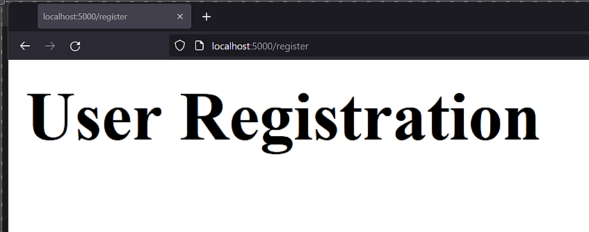

# QuartFeed, an SSE appplication using PostgreSQL <!-- 5 -->

## Introduction to Server Sent Events <!-- 5.1 -->
Server Sent Events, or SSEs, or EventSource in JavaScript, are an extension to HTTP that allow a client to keep a connection open to a server, thereby allowing the server to send events to the client as it chooses.

By default, the server sends updates with a `data` payload. You can also have an `event` type, which by default is `message`, but could be things like `add` or `remove`. Additionally it has an `id` parameter that allows the client to continue where it left off if the connection was lost.

We are going to build a lightweight version of the popular FriendFeed website, one of the pioneers in the social media space. using Quart and SSE.

For our FriendFeed clone we’ll have the event type to be either `post`, which is a new post, `like` if some one liked the post and `comment` if it’s a comment to a `post`.

For a more complex version or exercise to students, we could also have `groups`, which could be distinct `/sse` endpoints and `like` events for comments.

## QuartFeed Application Setup (step-0) <!-- 5.2 -->

So let's start setting up our QuartFeed application. 

To start, we can clone the Quart PostgreSQL Boilerplate code that we built in the previous lesson. You can grab the latest version from my [Github repo here](https://github.com/fromzeroedu/quart-postgres-boilerplate).

If you still have the code in your computer, like I do, you can just make a copy of it. Make sure to rename the folder to something like "quartfeed_app".

If you have cache files lying around after the copy, make sure to delete those folders.

We begin by installing the requirements. Edit `pyproject.toml` and change the name of the application to "quartfeed_app". [Save the file](https://fmze.co/fftq-5.2.7).

Now let's go ahead and rename the `counter_app` directory to `user_app` since that will be the first module we will be working on.

Next open the `models.py` file inside the new `user` folder.

Modify the file as follows.

{lang=python,line-numbers=on}
```
from sqlalchemy import Table, Column, Integer, String

from db import metadata

user_table = Table(
    "user",
    metadata,
    Column("id", Integer, primary_key=True),
    Column("username", String(15), index=True, unique=True),
    Column("password", String(128)),
)
```

First rename the table to `user_table` and change the table name, which is the first `Table` property to "user".

The `metadata` property will still come from the `db` module so leave that.

The first column, "id" will remain the same -- we still want that primary key in the table.

The second column we'll call "username". This is the first time we'll use the "String" `sqlalchemy` type, so let's add that to the import list on line 1. We'll define the length as `15` and then set the `index` property to `True` since we want to be able to search for users quickly using the `username` as a query, and finally we'll say that this column should be unique, since no two users should have the same username.

The next column is `password`, which is also a string with a length of 128 which coincides with the hashing algorithm we're going to use, which always generates a hash of 128 characters.

[Save the file](https://fmze.co/fftq-5.2.1).

Next, let's change the `user/views.py` file.

{lang=python,line-numbers=on}
```
from quart import Blueprint, current_app, Response

from user.models import user_table

user_app = Blueprint("user_app", __name__)


@user_app.route("/register")
async def register() -> str:
    return "<h1>User Registration</h1>"
```

On line 3, let's update the import to add the `user_table`.

Update line 5 to rename `counter_app` to `user_app`.

We actually don't need any of thie view function, so we'll go ahead and delete it.

On line 8 update the route to use the `user_app` and on line 9 we'll rename the function to `register` and we'll call this on the `/register` end point.

Finally we'll have this function just return the string "User Registration" just to make sure everything is working correctly.

[Save the file](https://fmze.co/fftq-5.2.2).

Let's go ahead and update the `application.py`. On line 9 and 31, update the `counter_app` to say `user_app`:

{lang=python,line-numbers=on,starting-line-number=9}
```
from my_app.user_app.views import user_app
```

{lang=python,line-numbers=on,starting-line-number=31}
```
    app.register_blueprint(user_app)
```

[Save the file](https://fmze.co/fftq-5.2.3).

At this point, I want to make sure the application is running, by doing: `poetry run quart run`, and if I now go to `localhost:5000` on the `/register` endpoint, we can see that the application responds with the "User Registration" string, so all the routing seems to be working correctly.



If you are using VSCode, we can also use the run button on the editor, since we have the launcher files in our repository, and the nice thing with this approach is that we can set breakpoints and debug our application.

Ok, so let's start working on our migrations. The first thing we're going to do is go to the `migrations` folder and remove all files and directories from the `versions` folder, since these are all related to the `counter` app.

There's no need to change anytthing on the `alembic.ini` since we're using the same connection method.

Next, we'll take a look at the `env.py` on the `migrations` folder, and alll we need to do here is update the user model on line 27 like so:

{lang=python,line-numbers=on,starting-line-number=12}
```
from my_app.user_app.models import user_table
```

Also please remember if we add any new models, we need to add it here, so that the migrations script can detect any new schemas.

[Save the file](https://fmze.co/fftq-5.2.4).

If you still have the containers and the images from the counter app, go ahead and delete them: both the web app and the database app. You can use the Docker Desktop application or the VSCode plugin.

So go ahead and run `docker-compose up --build` and that will build our new application and PostgreSQL containers.

After it finishes building, exit using `CTRL-C`, and then run just the database container so that we can execute our migration.

So we do: `poetry run alembic revision --autogenerate -m "Create user table"`. This will use the models metadata and create a new `versions` file so keep an eye out on that folder.

If you are using Docker, you can do `docker-compose run --rm web poetry run alembic revision --autogenerate -m "create user table"`

{lang=bash,line-numbers=off}
```
$ poetry run alembic revision --autogenerate -m "Create user table"
INFO  [alembic.runtime.migration] Context impl PostgresqlImpl.
INFO  [alembic.runtime.migration] Will assume transactional DDL.
INFO  [alembic.autogenerate.compare] Detected added table 'user'
INFO  [alembic.autogenerate.compare] Detected added index 'ix_user_username' on '['username']'
  Generating /opt/from-flask-to-quart-
  course/code/5_quart_feed/quartfeed_app/migrations/versions/c093ae180e73_create_user_table.py ...  done
```

Perfect! So now we check the new `versions` file.

{lang=python,line-numbers=on,starting-line-number=1}
```
"""create user table

Revision ID: 7c33d8dfbca6
Revises: 
Create Date: 2022-02-09 08:57:49.647375

"""
from alembic import op
import sqlalchemy as sa


# revision identifiers, used by Alembic.
revision = '7c33d8dfbca6'
down_revision = None
branch_labels = None
depends_on = None


def upgrade():
    # ### commands auto generated by Alembic - please adjust! ###
    op.create_table('user',
    sa.Column('id', sa.Integer(), nullable=False),
    sa.Column('username', sa.String(length=15), nullable=True),
    sa.Column('password', sa.String(length=128), nullable=True),
    sa.PrimaryKeyConstraint('id')
    )
    op.create_index(op.f('ix_user_username'), 'user', ['username'], unique=True)
    # ### end Alembic commands ###


def downgrade():
    # ### commands auto generated by Alembic - please adjust! ###
    op.drop_index(op.f('ix_user_username'), table_name='user')
    op.drop_table('user')
    # ### end Alembic commands ###

```

As we can see, the file has an `upgrade` section where the user table is created with the `id`, `username` and `password` columns, as well as creating an index on `username`.

The `downgrade` function, drops the `username` index and then drops the `user` database.

The next step is to apply the changes on the database using `poetry run alembic upgrade head`.

{lang=bash,line-numbers=off}
```
$ poetry run alembic upgrade head
INFO  [alembic.runtime.migration] Context impl PostgresqlImpl.
INFO  [alembic.runtime.migration] Will assume transactional DDL.
INFO  [alembic.runtime.migration] Running upgrade  -> 7c33d8dfbca6, create user table
```

Great! So that applied the changes in the database and should have created the `user` table on our PostgreSQL container. Let's go ahead and check that out.

To connect to the database, run the following command in a new shell:

{lang=bash,line-numbers=off}
```
$ docker exec -it app_db_1 psql postgres -U app_user
```

So now we're on PostgreSQL. We can see the databases by doing `\l`, and as you can see there's an `app` database owned by the user `app_user`:

{lang=bash,line-numbers=off}
```
# \l
                                 List of databases
   Name    |  Owner   | Encoding |  Collate   |   Ctype    |   Access privileges   
-----------+----------+----------+------------+------------+-----------------------
 app       | app_user | UTF8     | en_US.utf8 | en_US.utf8 | 
 postgres  | app_user | UTF8     | en_US.utf8 | en_US.utf8 | 
 template0 | app_user | UTF8     | en_US.utf8 | en_US.utf8 | =c/app_user          +
           |          |          |            |            | app_user=CTc/app_user
 template1 | app_user | UTF8     | en_US.utf8 | en_US.utf8 | =c/app_user          +
           |          |          |            |            | app_user=CTc/app_user
(4 rows))
```

We can connect to the `app` database by doing `\c app` and if we list the tables there by using `\dt`, we'll see that we have the `alembic_version` table and the `user` table created.

{lang=bash,line-numbers=off}
```
\dt
              List of relations
 Schema |      Name       | Type  |  Owner   
--------+-----------------+-------+----------
 public | alembic_version | table | app_user
 public | user            | table | app_user
(2 rows)
```

We can check the contents of the `alembic_version` table by doing `SELECT * FROM alembic_version`.

{lang=bash,line-numbers=off}
```
# SELECT * from alembic_version;
 version_num  
--------------
 7c33d8dfbca6
(1 row)
```

As you can see, the `version_num` field coincides with the revision ID on the `versions` file.

We can also check the schema for the user table by doing: `\d user`.

{lang=bash,line-numbers=off}
```
# \d user;
                                     Table "public.user"
  Column  |          Type          | Collation | Nullable |             Default              
----------+------------------------+-----------+----------+----------------------------------
 id       | integer                |           | not null | nextval('user_id_seq'::regclass)
 username | character varying(15)  |           |          | 
 password | character varying(128) |           |          | 
Indexes:
    "user_pkey" PRIMARY KEY, btree (id)
    "ix_user_username" UNIQUE, btree (username)
```

We have the `id` which has a `nextval` function, meaning it automatically increments by one with each record, the username and password with the right lengths and the two indexes; one for the `id` and the other for the `username`.

Everything looks good, so we're ready to start working on the user registration component of our Quart application.


## User Registration - Initial Setup (step-1) <!-- 5.3 -->

We’re going to create a templates folder with a base and navbar templates using bootstrap. We’ll also create the `user` templates folder and create the `register.html` template in it.

{lang=html,line-numbers=on}
```
<!DOCTYPE html>
<html lang="en">

<head>
    <!-- Required meta tags -->
    <meta charset="utf-8">
    <meta name="viewport" content="width=device-width, initial-scale=1">

    <!-- Boostrap CSS -->
    <link href="https://cdn.jsdelivr.net/npm/bootstrap@5.1.3/dist/css/bootstrap.min.css" rel="stylesheet"
    integrity="sha384-1BmE4kWBq78iYhFldvKuhfTAU6auU8tT94WrHftjDbrCEXSU1oBoqyl2QvZ6jIW3" crossorigin="anonymous">

    <title></title>
</head>

<body>
    <div class="container">
        
    </div>

    <!-- Bootstrap JS -->
    <script src="https://cdn.jsdelivr.net/npm/bootstrap@5.1.3/dist/js/bootstrap.bundle.min.js"
    integrity="sha384-ka7Sk0Gln4gmtz2MlQnikT1wXgYsOg+OMhuP+IlRH9sENBO0LRn5q+8nbTov4+1p"
    crossorigin="anonymous"></script>

</body>

</html>
```

First we create the `base.html` and this will be a shell of a standard HTML document with its required tags.

Let's open and close the `<html>` tag. 

Then we create the `<head>` opening and closing tags and inside we'll put some `meta` tags that describe some of the characteristics of the document, including its character set which we'll set as `utf-8` and the viewposrt size.

We're going to be using Bootstrap, a presentation framework that will make it easier to make the application more appealing visually, so let's grab the CSS for Bootstrap from their recommended CDN.

Finally we'll make the title a Jinja block, which we can override from each one of the templates.

Now we start with the body of the page. We'll insert all of the content from other templates, so we make this a container Bootstrap element and inside we'll define a `content` Jinja block.

Finally we need the Javascript component of Bootstrap, so we'll add it at the bottom of the page.

[Save the file](https://fmze.co/fftq-5.3.1) and now let's create the `navbar.html` template.

This navbar we'll use is actually a Bootstrap component, so I'm pretty much going to copy their initial setup and then customize it to have a "Login" and "Register" navigation elements.

{lang=html,line-numbers=on}
```
<nav class="navbar navbar-expand-lg navbar-light bg-light">
    <div class="container-fluid">
        <a class="navbar-brand" href="#">QuartFeed</a>
        <button class="navbar-toggler" type="button" data-bs-toggle="collapse" data-bs-target="#navbarNavAltMarkup" aria-controls="navbarNavAltMarkup" aria-expanded="false" aria-label="Toggle navigation">
        <span class="navbar-toggler-icon"></span>
        </button>
        <div class="collapse navbar-collapse" id="navbarNavAltMarkup">
        <div class="navbar-nav">
            <a class="nav-link" href="#">Login</a>
            <a class="nav-link" href="#">Register</a>
        </div>
        </div>
    </div>
</nav>
```

[Save the file](https://fmze.co/fftq-5.3.1).

Next we'll create a folder inside the `templates` directory called `user`. As you know from other courses, I like to keep the templates for each module separated in folders.

Inside we'll create `register.html` which essentially will be a Bootstrap form.

{lang=html,line-numbers=on}
```


Registration





<div class="row">

    <div class="col-md-offset-3 col-md-6">

        <h3>Registration</h3>

        
        <div class="text-danger">{{ error }}</div>
        

        <form method="POST" action="{{ url_for('.register') }}" role="form">

            <div class="mb-3">
                <label for="username" class="form-label">Username</label>
                <input name="username" type="text" class="form-control" id="username" 
                value="{{ username }}"
                placeholder="Select a username" />
            </div>

            <div class="mb-3">
                <label for="password" class="form-label">Password</label>
                <input name="password" type="password" class="form-control" id="password" 
                placeholder="Password" />
            </div>

            <button type="submit" class="btn btn-default">Register</button>

        </form>

    </div>

</div>


```

So first we'll extend the `base.html` template so that this template is embedded within the base html file. We define the title using a Jinja block and then create the content block.

Let's add the navbar right at the beginning of the content block.

Next, we create a Bootstrap row to contain all the form. 

We then define a div that will be 6 units wide with an offset of 3 units from the left of the page.

We put a registration sub-title and then define an error block if there is any error being passed to the template.

Now it's time to create the form. It will be a POST, since we will be sending data from the page and we define the action using the Jinja `url_for` property. This is a best practice; we don't use actual URLs anywhere on our forms, so that they can be dynamically generated.

Next we create the input fields using the Bootstrap recommendations. First the username and then the password.

Finally we create a submit button and that's it, we're done.

[Save the file](https://fmze.co/fftq-5.3.3).

Our last step is to modify the `user/views` controller.

First we add the `render_template` module from `Quart`, add the methods to the view, so that it accepts both `GET` and `POST`, and finally add the render template function, but notice the format here; it's `return await` and not `await return`.

[Save the file](https://fmze.co/fftq-5.3.4) and start the application. On your browser, head over to `localhost:5000/register` and you should see our registration form.

Looking good! Now let's actually read these variables from the form on the next lesson.


## User Registration -Using Quart-WTForm (step-2) <!-- 5.4 -->

So let's go ahead and check out how to read the username and password fields that we are going to get from this form. We need to process this form in a slightly different way because of our async workflow and we're going to check that out.

First we install the Quart-wtf package.

```poetry add quart-wtf```

Create the form.py on user_app:

```
from quart_wtf import QuartForm
from wtforms import PasswordField, StringField
from wtforms.validators import DataRequired
from wtforms.widgets import PasswordInput


class UserRegisterForm(QuartForm):
    username = StringField(
        "Username", validators=[DataRequired()], render_kw={"autocomplete": "off"}
    )
    password = PasswordField(
        "Password",
        validators=[DataRequired()],
        widget=PasswordInput(hide_value=False),
    )
```

Create a `_formhelpers`

```

<div class="form-group">
    {{ field.label }}
    {{ field(**kwargs)|safe }}
    
    <ul class="text-danger">
        
        <li>{{ error }}</li>
        
    </ul>
    
</div>

```

Modify the register.html form:

```


Registration





<div class="row">

    <div class="col-md-offset-3 col-md-6">

        <h3>Registration</h3>

        

        <form method="POST" action="{{ url_for('.register') }}" role="form">

            <div class="mb-3">
                {{ render_field(form.username, class='form-control') }}
            </div>

            <div class="mb-3">
                {{ render_field(form.password, class='form-control') }}
            </div>

            {{ form.csrf_token }}
            <button type="submit" class="btn btn-primary">Register</button>

        </form>

    </div>

</div>


```

Now we're ready to process the form:

```
@user_app.route("/register", methods=["GET", "POST"])
async def register() -> str:
    form = await UserRegisterForm.create_form()
    error = None

    if await form.validate_on_submit():
        return "Success"

    return await render_template(
        "user/register.html",
        form=form,
        error="",
    )
```


## Processing the form (step-3) <!-- 5.5 -->

We install passlib and explain we don't store plain text passwords.

```
@user_app.route("/register", methods=["GET", "POST"])
async def register() -> str:
    form = await UserRegisterForm.create_form()
    error = None

    if await form.validate_on_submit():
        # Check if the user already exists
        conn = current_app.dbc  # type: ignore
        user_query = (
            user_table.select()
            .where(user_table.c.username == form.username.data)
            .limit(1)
        )
        result = await conn.fetch_all(query=user_query)

        if len(result):
            error = "User already exists"

        if not error:
            # Hash the password
            password_hash: str = pbkdf2_sha256.hash(form.password.data)

            # Insert the user into the database
            insert_query = user_table.insert().values(
                username=form.username.data,
                password=password_hash,
            )
            await conn.execute(insert_query)
            await conn.commit()

    return await render_template(
        "user/register.html",
        form=form,
        error=error,
    )
```

## User Login (step-4) <!-- 5.6 -->

Create the login template:

```


Login





<div class="row">

    <div class="col-md-offset-3 col-md-6">

        <h3>Login</h3>

        
        <div class="text-danger">{{ error }}</div>
        

        

        <form method="POST" action="{{ url_for('.login') }}" role="form">

            <div class="mb-3">
                {{ render_field(form.username, class='form-control') }}
            </div>

            <div class="mb-3">
                {{ render_field(form.password, class='form-control') }}
            </div>

            {{ form.csrf_token }}
            <button type="submit" class="btn btn-primary">Login</button>

        </form>

    </div>

</div>


```

Add the login and logout view functions:

```
@user_app.route("/login", methods=["GET", "POST"])
async def login() -> str:
    form: QuartForm = await UserRegisterForm.create_form()
    error: Optional[str] = None

    if await form.validate_on_submit():
        # Lookup the user in the database
        conn = current_app.dbc  # type: ignore
        user_query = (
            user_table.select()
            .where(user_table.c.username == form.username.data)
            .limit(1)
        )
        result = await conn.fetch_all(query=user_query)

        if not len(result):
            error = "Invalid username or password"
        else:
            user = result[0]

        # check the password
        if not error:
            if not pbkdf2_sha256.verify(form.password.data, user["password"]):
                error = "Invalid username or password"

        # login the user
        if not error:
            session["user_id"] = user["id"]
            session["username"] = user["username"]
            return "User logged in"

    return await render_template(
        "user/login.html",
        form=form,
        error=error,
    )


@user_app.route("/logout", methods=["GET"])
async def logout() -> "Response":
    del session["user_id"]
    del session["username"]
    return redirect(url_for(".login"))
```

Show on the navbar the login status:

```
                
                <li class="nav-item dropdown">
                    <a class="nav-link dropdown-toggle" href="#" id="userDropdown" role="button"
                        data-bs-toggle="dropdown" aria-expanded="false">
                        @{{ session.username }}
                    </a>
                    <ul class="dropdown-menu" aria-labelledby="userDropdown">
                        <li><a class="dropdown-item" href="#">View profile</a></li>
                        <li><a class="dropdown-item" href="#">Edit profile</a></li>
                        <li><a class="dropdown-item" href="#">Change password</a></li>
                        <li>
                            <hr class="dropdown-divider">
                        </li>
                        <li>
                            <a class="dropdown-item" href="{{ url_for('user_app.logout') }}">Logout</a>
                        </li>
                    </ul>
                </li>
                
                <a class="nav-link" href="{{ url_for('user_app.login') }}">Login</a>
                <a class="nav-link" href="{{ url_for('user_app.register') }}">Register</a>
                
```


## Testing User Registration and User Login (step-5) <!-- 5.7 -->

Add flash message on login to be able to tell if a user registered:

```
        
        <div class="alert alert-success">{{ message }}</div>
        
```

Add the message on the register view:

```
            await conn.execute("COMMIT")

            # add a flash message
            await flash("User registered successfully, please login")
            return redirect(url_for(".login"))
```

Add testing on settings.toml:

```
[testing]
TESTING = true
DB_HOST = "localhost"
DATABASE_NAME = "app_test"
WTF_CSRF_ENABLED = false

[docker-testing]
TESTING = true
DB_HOST = "db"
DATABASE_NAME = "app_test"
WTF_CSRF_ENABLED = false

[devcontainer-testing]
TESTING = true
DB_HOST = "db"
DATABASE_NAME = "app_test"
WTF_CSRF_ENABLED = false

[testing_gha]
TESTING = true
DB_HOST = "localhost"
DATABASE_NAME = "app_test"
WTF_CSRF_ENABLED = false
```

Add the devcontainer testing on conftest:

```
    if settings.ENV_FOR_DYNACONF == "DEVCONTAINER":
        settings.configure(FORCE_ENV_FOR_DYNACONF="DEVCONTAINER-TESTING")
```

Add the tests:

```
import pytest
from quart import Quart, current_app
from quart.testing import QuartClient

from my_app.user_app.models import user_table


def user_dict() -> dict:
    return dict(username="testuser", password="test123")


@pytest.mark.asyncio
async def test_registration(
    create_test_client: QuartClient, create_test_app: Quart
) -> None:
    # register user
    response = await create_test_client.post(
        "/register", form=user_dict(), follow_redirects=True
    )
    body = await response.get_data(as_text=True)
    assert "User registered successfully, please login" in body

    # check if user is in database
    async with create_test_app.app_context():
        conn = current_app.dbc  # type: ignore
        user_query = user_table.select().limit(1)
        result = await conn.fetch_all(query=user_query)
        result_row = result[0]
        assert result_row["username"] == user_dict()["username"]

        # check password is not stored in plain text
        assert result_row["password"] != user_dict()["password"]

    # missing fields
    response = await create_test_client.post(
        "/register", form={}, follow_redirects=True
    )
    body = await response.get_data(as_text=True)
    assert "This field is required" in body

    response = await create_test_client.post(
        "/register", form={"username": user_dict()["username"]}, follow_redirects=True
    )
    body = await response.get_data(as_text=True)
    assert "This field is required" in body


@pytest.mark.asyncio
async def test_login(create_test_client: QuartClient) -> None:
    # register user
    response = await create_test_client.post(
        "/register", form=user_dict(), follow_redirects=True
    )

    # login registered user
    response = await create_test_client.post(
        "/login", form=user_dict(), follow_redirects=True
    )
    body = await response.get_data(as_text=True)
    assert "User logged in" in body  # TODO: change this when we have home page

    # Check that the session is being set
    async with create_test_client.session_transaction() as sess:
        assert sess["username"] == user_dict()["username"]

    # try to login with wrong password
    response = await create_test_client.post(
        "/login",
        form={"username": user_dict()["username"], "password": "wrongpassword"},
        follow_redirects=True,
    )
    body = await response.get_data(as_text=True)
    assert "Invalid username or password" in body

    # try to login with inexistent user
    response = await create_test_client.post(
        "/login",
        form={"username": "inexistentuser", "password": "wrongpassword"},
        follow_redirects=True,
    )
    body = await response.get_data(as_text=True)
    assert "Invalid username or password" in body


@pytest.mark.asyncio
async def test_logout(create_test_client: QuartClient) -> None:
    # register user
    response = await create_test_client.post(
        "/register", form=user_dict(), follow_redirects=True
    )

    # login registered user
    response = await create_test_client.post(
        "/login", form=user_dict(), follow_redirects=True
    )

    # logout
    response = await create_test_client.get("/logout", follow_redirects=True)
    body = await response.get_data(as_text=True)
    assert "You have been logged out" in body

    # Check that the session is being set
    async with create_test_client.session_transaction() as sess:
        assert sess.get("username") == None
```

## Relationship Module (step-6) <!-- 5.8 -->

- Relationship: set relationships `fm_userid -> to_userid`

We’ll create the relationship between users. We can enforce bi-directional (like Facebook friends) or unidirectional (like Twitter followers). We’ll do the second to simplify the code.

Create the model:

```python
from sqlalchemy import Column, Table, Integer, ForeignKey

from user.models import metadata as UserMetadata

relationship_table = Table(
    "relationship",
    UserMetadata,
    Column("id", Integer, primary_key=True),
    Column("fm_user_id", Integer, ForeignKey("user.id")),
    Column("to_user_id", Integer, ForeignKey("user.id")),
)
```
We need to use the `UserMetadata` since we are going to establish a foreign key to the user table.

Add the `relationship_table` to migrations/env.py
```python
from user.models import metadata as UserMetadata
from relationship.models import relationship_table

target_metadata = [UserMetadata]
```
We import it so that the auto-discovery can “see” the new table. However, notice we don’t add anything to the `target_metadata`_ 

Migration Execution
- Create the commit with `pipenv run alembic revision --autogenerate -m "create relationship table"`
- Check that the versions file was created properly, and then,
- Run the first migration with `pipenv run alembic upgrade head`

Create a simple profile user view so that you can follow other users:
- Created a `profile` route function, where we fetch the username and if we don’t find him, return a 404, and then fetch the relationship status
- Created a basic `profile.html` with a follow/unfollow/edit profile button
- Create `relationship.views` with the routes
- Add `relationship` blueprint to `application`
- Add `login_required` decorator

## Follow/Unfollow users (step-7) <!-- 5.9 -->

https://github.com/esfoobar/quart-feed/compare/step-6...step-7

- Added common methods to get users and check relationships to start a DRY pattern
- Created relationship add and remove


## Add relationship tests <!-- 5.10 -->
User tests: https://github.com/esfoobar/quart-feed/blob/9a30be612ed2905468f777b6f05de7fd0dbe5de7/user/test_user.py

Relationship tests: https://github.com/esfoobar/quart-feed/blob/9a30be612ed2905468f777b6f05de7fd0dbe5de7/relationship/test_relationship.py


## Profile Edit (step-8) <!-- 5.11 -->

https://github.com/esfoobar/quart-feed/compare/step-7...step-8

### Profile edit
 - Setup form
- Views processing

## Add a profile image (step-9) <!-- 5.12 -->

https://github.com/esfoobar/quart-feed/compare/step-8...step-9

- Add a profile image
	- [Profile template](https://github.com/esfoobar/flaskbook/blob/master/templates/user/profile.html), [view processing](https://github.com/esfoobar/flaskbook/blob/master/user/views.py#L144-L149), [resize utility](https://github.com/esfoobar/flaskbook/blob/68fbd6ebd5344ff5a9a45dc2b607187a39490562/utilities/imaging.py)

- added imagemagick-dev to Dockerfile
- added wand to Pipfile
- Added enctype to form and image section
- Added UPLOADS\_FOLDER, IMAGES\_FOLDER, IMAGE\_URL to settings, .quartenv, docker-compose.yml
- Added saving functionality on user/views.py:profile\_edit
- added utilities/imaging.py
- -Added profile image\_url dict on get user by username
- added image field to user , did a migration:
	- `docker-compose run --rm web pipenv run alembic revision --autogenerate -m "added new image field user"` and then `docker-compose run --rm web pipenv run alembic upgrade head`
- Added image to profile edit and to profile page
- Added empty profile image to repo

## Fix tests (hotfix) <!-- 5.12.x -->
- Take out create_all from conftest
- Take create_all and create_test_app from all tests

## Create a Post (step-10) <!-- 5.13 -->

- created the post blueprint with the basic view controller
- created post model
	- Added server side datetiime using `server_defaault` per [instructions here]((https://stackoverflow.com/questions/13370317/sqlalchemy-default-datetime)
- created home page post form
- add the new model to migrations/env.py
- did a migration


## Friends Posts on Homepage using SSE (step-11) <!-- 5.14 -->

- added broadcast.js
- added broadcast.js on home page
- created followers method on relationship
- add the post to the followers feed 
- added updated field to feed table
- get the latest 10 posts from feed order by desc updated
- user image url method (`image_url_from_image_ts`)
- IMPORTANT: This step just prints out the events to the JS Console, no templating yet. The initial render does work on the home page

## Template Literals (step-12) <!-- 5.15 -->

- Create template literal for the whole section
- Pass the full post information on the context
- To print the actual statement: `print(stmt.compile(compile_kwargs={"literal_binds": True}))`
- NOTE: I've noticed that if you do code changes while the Quart application is running and the SSE page is open, erratic behavior can appear. Make sure to do the code changes, save, then stop and start Docker and do a HARD RELOAD of the browser page

## Databases Migration (step-13) <!-- Not necessary -->

- Moved database connectivity over to [databases](https://www.encode.io/databases/)
- Testing and migrations updates

## Comments (step-14) <!-- 5.16 -->

- Setup comments form toggle display and entry
- Post comment to backend
- Get comments query and add to context
- Render new comments from SSE

## Likes (step-15) <!-- 5.17 -->

- Post likes to backend
- Finish frontend

- Test posts, comments and likes

